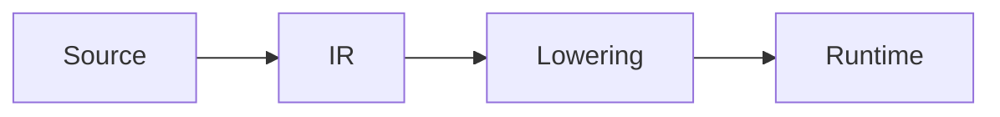

# Little Hamster 的技术主页

这是一个基于 Hugo Extended 和 PaperMod 的个人技术主页、研究主页和技术博客，记录以下技术路径：

```text
Reverse Engineering / Pwn / CTF
            ↓
      Systems Security
            ↓
      Compiler Security
            ↓
        AI Compiler
```

线上地址：<https://blog.little-hamster-xu.workers.dev/>

## 本地运行

```powershell
hugo server --buildDrafts
```

打开 <http://localhost:1313/> 预览。

Windows 本地使用数学公式时，如果遇到 Hugo cache 跨磁盘错误，可以使用项目内 cache：

```powershell
hugo --cacheDir .hugo_cache --gc --minify
```

## 网站结构

- `/`：个人定位、目前项目、代表性项目、安全基础和近期文章
- `/research/`：公开技术方向、可分享成果和工具链
- `/security/`：Reverse Engineering、Pwn、CTF 和系统安全积累
- `/projects/`：按 Problem、Design、Result、Limitations 记录项目
- `/contributions/`：整理 upstream issue、PR、修复和维护者反馈
- `/posts/`：完整技术文章；内容规模扩大后再考虑拆分 Notes
- `/about/`：简短个人介绍、技术路径和联系方式
- `/archives/`：文章归档
- `/search/`：PaperMod 自带 Fuse.js 搜索

## 新建文章

```powershell
hugo new content posts/my-post.md
```

文章写在 `content/posts/` 中。建议为重要文章填写明确的 `description` 或 `summary`，并使用稳定的分类和标签，例如：

```yaml
categories: [Compiler]
tags: [TVM, Compiler Correctness, Fuzzing]
```

当前 taxonomy 只保留 `categories` 和 `tags` 两层，不为每个关键词创建一次性标签。

## 数学公式

需要公式的页面在 front matter 中开启：

```yaml
math: true
```

支持 `\\(...\\)` 行内公式和 `$$...$$` / `\\[...\\]` 块公式。公式由 Hugo 构建时使用内置 KaTeX 转换，不加载数学 JavaScript。

## Mermaid 图表

直接使用 Mermaid fenced code block：

````markdown

````

只有包含 Mermaid 的页面才会加载 Mermaid ESM 模块。普通代码块继续使用 Hugo Chroma 和 PaperMod 的复制按钮。

## Callout

使用轻量 shortcode：

```markdown

这里记录实验限制或复现条件。

```

可用类型：`note`、`warning`、`insight`、`result`、`caveat`。

## Cloudflare 部署

Cloudflare Pages / Workers 的 Git 集成配置：

```text
Production branch: main
Build command: hugo --gc --minify
Build output directory: public
HUGO_VERSION: 0.166.0
```

推送到 `main` 后由 Cloudflare 自动构建和发布。正式地址配置在 `hugo.yaml` 中，因此 canonical、Open Graph、RSS 和 sitemap 会统一指向线上站点。

GitHub Pages workflow 作为备用发布链路保留，但不会覆盖正式站点的 baseURL。

## 维护说明

- `themes/PaperMod` 保存为当前公开快照，不包含主题仓库历史，也不直接修改主题源码。
- 更新 PaperMod 前先对比官方仓库，完成本地构建和页面检查后再更新快照。
- 站点扩展优先放在 `layouts/`、`assets/`、`data/` 和 `content/` 中。
- 暂不引入 Giscus、Pagefind、citation plugin、analytics 或前端框架；等真实需求出现后再单独评估。
