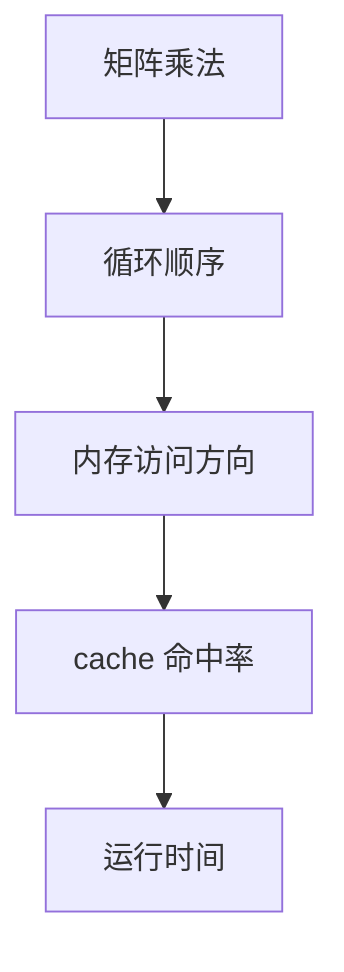
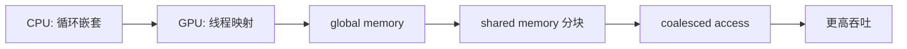

为了学 CUDA，我没有从 API 清单开始，而是先把一个小型矩阵库重新读了一遍。这个项目叫 `mini-tensor`：保存矩阵、执行矩阵乘法、比较循环顺序，再用基准测试验证猜想。

它把几件容易分开学习的事串了起来：C++ 的对象和所有权、内存中的 shape 与 stride、头文件和链接、CPU 缓存，以及最后通往 CUDA 的线程模型。

## 先说结论

- **数据结构先于优化。** 如果不知道一个元素的地址怎样算出来，后面的 cache、shared memory 都只是名词。
- **所有权要明确。** `std::vector`、RAII 和智能指针让资源在异常和早退时仍然可靠。
- **性能取决于访问路径。** 同一组乘加，`ijk` 和 `ikj` 的速度可以明显不同，因为它们触碰缓存的方式不同。
- **优化必须用数据收尾。** 分块循环并不保证更快；分块大小、编译选项和机器缓存一起决定结果。

## 1. 从一个元素开始：shape、stride 和地址

矩阵通常用两个数字描述形状：行数 `M` 和列数 `N`。但程序真正需要的是地址。对连续的 row-major 矩阵，元素 `(i, j)` 的位置可以写成：

```text
offset = i * row_stride + j
```

`mini-tensor` 把这些信息集中放在一个对象中：

```cpp
class Matrix {
public:
    Matrix(std::size_t rows, std::size_t cols);
    float& operator()(std::size_t i, std::size_t j);
    const float& operator()(std::size_t i, std::size_t j) const;
private:
    std::size_t rows_, cols_, row_stride_;
    std::vector<float> data_;
};
```

访问运算符只做一件事：把二维坐标翻译成一维偏移。

```cpp
float& Matrix::operator()(std::size_t i, std::size_t j) {
    return data_[i * row_stride_ + j];
}
```

当前实现是连续存储，所以 `row_stride_ == cols_`。把 stride 单独保留下来，是为了给后续的 padding、切片和 view 留出接口。


shape、stride 和 contiguous 不是抽象标签，而是数据布局的说明书。

## 2. C++ 里最容易被低估的三件事

### 引用、指针和 `const`

引用适合表达“这里一定有一个对象”，指针适合表达“这里可能没有对象，或者我需要做地址运算”。`const` 则是在接口上说明谁可以修改数据。

```cpp
float sum_row(const Matrix& x, std::size_t row);
void fill_row(Matrix& x, std::size_t row, float value);
```

读接口拿 `const&`，避免拷贝并禁止修改；写接口拿 `&`，把修改权限写在函数签名里。

### 生命周期和 RAII

`Matrix` 把内存交给 `std::vector<float>` 管理。构造时分配，析构时释放；中途抛异常或提前返回，也不需要手写清理代码。这就是 RAII：资源的生命周期绑定到对象生命周期。

需要独占动态资源时，优先使用 `std::unique_ptr`；确实存在共享所有权时再考虑 `std::shared_ptr`。智能指针解决的是所有权，不能替代对数据布局和并发访问的理解。

## 3. 从源码到可执行文件

一个 `.cpp` 文件会经过预处理、编译、汇编和链接：


`mini-tensor` 用 CMake 把库和可执行文件分开组织：

```cmake
add_library(matrix src/matrix.cpp src/matmul.cpp)
add_executable(app main.cpp)
target_link_libraries(app PRIVATE matrix)
```



```bash
cmake -S . -B build -DCMAKE_BUILD_TYPE=Release
cmake --build build -j
./build/app
```



## 4. 同一个矩阵乘法，为什么顺序会影响速度

矩阵乘法的数学定义没有变化：

\[
C_{ij}=\sum_k A_{ik}B_{kj}
\]

最直观的 `ijk` 写法是：

```cpp
for (std::size_t i = 0; i < M; ++i)
    for (std::size_t j = 0; j < N; ++j)
        for (std::size_t k = 0; k < K; ++k)
            C(i, j) += A(i, k) * B(k, j);
```

交换成 `ikj` 后，`A(i, k)` 被取出一次，随后连续更新 `C` 的一整行：

```cpp
for (std::size_t i = 0; i < M; ++i)
    for (std::size_t k = 0; k < K; ++k)
        for (std::size_t j = 0; j < N; ++j)
            C(i, j) += A(i, k) * B(k, j);
```

CPU 会把附近的一段数据搬进 cache；访问连续时，这次搬运更容易被复用。





## 5. 分块优化：想法正确，结果仍然要测

分块（tiling）把大矩阵切成小块，让一组数据尽量停留在更快的缓存中：

```cpp
for (std::size_t ii = 0; ii < M; ii += tile)
    for (std::size_t kk = 0; kk < K; kk += tile)
        for (std::size_t jj = 0; jj < N; jj += tile)
            for (std::size_t i = ii; i < std::min(ii + tile, M); ++i)
                for (std::size_t k = kk; k < std::min(kk + tile, K); ++k)
                    for (std::size_t j = jj; j < std::min(jj + tile, N); ++j)
                        C(i, j) += A(i, k) * B(k, j);
```

一次 Release 构建的结果如下，数值用于观察趋势，不代表所有机器的绝对性能：

| N | ijk | ikj | tile=32 | tile=128 | tile=256 |
|---:|---:|---:|---:|---:|---:|
| 512 | 327.5 ms | 277.2 ms | 287.9 ms | 278.2 ms | 277.5 ms |
| 1024 | 2701.6 ms | 2222.8 ms | 2267.8 ms | 2210.6 ms | 2208.8 ms |

最有价值的结论不是“tile=256 永远最好”，而是：

1. 只调整循环顺序，就可能获得明显收益。
2. 分块有额外边界和循环开销，小矩阵上未必占优。
3. tile 大小和缓存层级相关，应该通过基准测试选择，而不是凭经验写死。

## 6. 这和 CUDA 有什么关系

CUDA 会把同一个问题换一种方式表达：CPU 上关心循环顺序和 cache，GPU 上还要关心线程、block、grid、global memory 和 shared memory。





学习 CUDA 前，先能回答这些问题：一个 tensor 的数据在哪里？二维坐标怎样映射到线性地址？谁拥有这段内存？一次访存会不会被相邻线程共同利用？优化后如何证明结果仍然正确？

## 最后：给下一步留一条清晰的路

这个小项目目前只做了连续 row-major 矩阵和 CPU 乘法。下一步可以沿着三条线继续：

1. **正确性：** 加入边界、随机输入和更严格的误差检查。
2. **性能：** 记录不同编译器、线程数和 tile 大小的基准结果，区分冷启动与稳态。
3. **CUDA：** 先把 `Matrix::data()` 拷贝到 device，再实现一个最小 kernel，最后比较 global memory 与 shared memory 的差别。

我想把这次学习记成一句话：**先把数据和生命周期讲清楚，再谈并行和加速。** CUDA 的线程模型很重要，但真正决定你能不能写出可靠 kernel 的，往往是此前对内存、布局和性能证据的理解。
