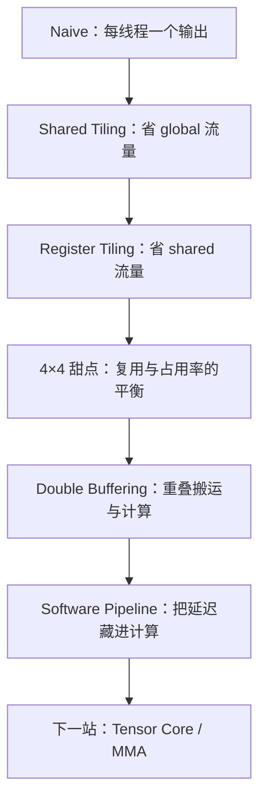

夜里十一点多，笔记本的风扇还在响，一阵紧似一阵。屏幕上的数字慢慢地变小，最后停在一行：

```text
time=1.77037 ms
performance=9704.1 GFLOPS
check=OK
```

我盯着它看了一会儿。早上开工的时候，同一块卡上跑出来的还是 3.67 TFLOPS，一天下来，翻了将近三倍。心里有一点说不出的欢喜，又有一点空——像是忙完了什么，又像是才刚刚开始。

这一天，从早到晚，做的其实只是一件事：把 `C = A × B` 在 GPU 上改快一点，再快一点。没有换算法，没有碰 Tensor Core，改的全是同一件事——数据怎么搬，什么时候搬。

可是比那个数字更让我记住的，是这一天里被反复打脸的几个瞬间：

- Occupancy 从 96.6% 掉到 78.4%，程序反而更快了；
- thread tile 继续加大，理论复用率明明更好，性能却掉回来；
- `4×8` 和 `8×4` 的复用率、寄存器数、shared load 指令数一模一样，实测差 5%；
- Nsight Compute 一直催我修 Global Store 的 8/32 B，修完指标很漂亮，runtime 一动不动；
- bank conflict 从 8390 万降到 1.9 万，kernel 更慢了；
- 最后让性能跳上去的那一版，寄存器和 shared memory 反而都用得更多。


前一篇《CUDA GEMM：把数据多用几次》讲的是原理和六版实现，这一篇是复盘，默认你已经知道 block、warp、shared memory 分别是什么。只想看结论，跳到「三桩反例」那一节；想自己跑一遍，源码和命令在最后一节。

关于数字的来源，先交代一句：中间几节的表格和计数器，是我写这篇文章时在同一台机器上复跑的，比值和当天记录一致，绝对值有几%漂移；标了「当天记录」的地方才是那天实验当时的输出。每张表都写了规模和口径，跨表别直接算倍数。


## 慢在哪里

矩阵乘法只有一行式子：

\[
C_{ij}=\sum_{k=0}^{K-1}A_{ik}B_{kj}
\]

### 一个线程算一个输出

最朴素的 CUDA 实现，是让一个线程算一个输出元素。代码短得像一句大白话：

```cpp
int row = blockIdx.y * blockDim.y + threadIdx.y;
int col = blockIdx.x * blockDim.x + threadIdx.x;

float sum = 0.0f;

for (int k = 0; k < N; ++k) {
    sum += A[row * N + k] * B[k * N + col];
}

C[row * N + col] = sum;
```

行列索引写对，基本就能跑起来。问题也摆在明处：每算一次 `A[row][k] * B[k][col]`，那两个数都要重新去显存里走一趟。而相邻的输出，用的往往是同一批数据——`C[0][0]` 和 `C[0][1]` 共享 A 的一整行，`C[0][0]` 和 `C[1][0]` 共享 B 的一整列。

这就是全部的矛盾所在：**GPU 的算力远远高于显存供数据的速度**。所以这一天反复问自己的问题，其实只有一句——

> 同一份数据，被搬进更快的存储层之后，怎样让它多用几次？

前半天所有的 tiling，都是在回答这句话。

### 数据住在哪儿

这一天的第一张脑图，是存储层次：

```text
        Global Memory            慢，容量大
              │
              ▼
        Shared Memory            快，容量小
              │
              ▼
          Registers
              │
              ▼
      CUDA Core / Tensor Core    算得快，等得久
```

越往下，容量越小，离计算单元越近，访问越快。于是「提高复用率」这件事，在层与层之间就有了两个不同的说法。一份数据从显存搬到 shared memory，希望整个 block 的线程都来用它；一个值从 shared memory 进到寄存器，希望它参与更多次 FMA。

对应到代码里，就是两个绕不开的名字：**Block Tile** 和 **Thread Tile**。前者决定一份 global 数据能被多少线程重复利用，后者决定一个线程读进来的值能用几次。前半天所有的来回，都是在这两个量之间找平衡。

它们的好处也能用一句话概括：「少搬一点」。

### 先把 block 分好

这一天用的 block tile 是：

```text
BM = 32, BN = 64, BK = 16
```

一个 block 负责算出 `32×64` 的一块 C，沿着 K 方向每次前进 `BK=16`：

```text
           BN = 64
      ┌─────────────────┐
      │                 │
BM=32 │      C tile     │
      │                 │
      └─────────────────┘
```

于是每一轮要搬进 shared memory 的是 `A tile: 32×16` 和 `B tile: 16×64`：

```cpp
__shared__ float As[BM][BK];
__shared__ float Bs[BK][BN];
```

搬进来之后，block 里所有线程都从这两块里取数：

```text
Global A/B
    ↓
Shared As/Bs
    ↓
整个 Block 复用
```

这一步买到的是 **Global → Shared 的复用**：一份从显存搬来的数据，服务的是整个 block，而不再是一个线程。别看它朴素，这一层就把 global 的读取量压下去了一个量级。

## 一个线程管多大

从 shared memory 到寄存器，还有一层复用可以挖。每个线程每轮 k 从 shared 取 TM 个 A、TN 个 B，然后做 `TM×TN` 次 FMA：

| Thread tile | 每轮 k 读取 | 每轮 k 的 FMA | 读取 / FMA |
|---|---:|---:|---:|
| 1×4 | 1 + 4 = 5 | 4 | 1.25 |
| 2×4 | 2 + 4 = 6 | 8 | 0.75 |
| 4×4 | 4 + 4 = 8 | 16 | **0.5** |
| 4×8 | 4 + 8 = 12 | 32 | 0.375 |

从 `2×4` 换到 `4×4`，每产生一次 FMA 所需的 shared 访问，从 0.75 次降到 0.5 次：

\[
\frac{0.5}{0.75}=\frac{2}{3}
\]

纸面上，shared load 的工作量该少掉三分之一。



**建议先自己玩一遍。** 上面这个动画里，三种映射算的是同一块 2×4 输出。切到 `1×1` 数一数读取次数，再切回 `2×4`：同样是 8 次 FMA，输入的读取次数从 16 降到 6。

### 纸上算出的 2/3

那么，纸上算出来的这个 2/3，有没有落到硬件上去呢？Nsight Compute 的 `smsp__inst_executed_op_shared_ld.sum` 给了我一个特别爽的回答：

| 版本 | shared load 指令数（N=2048） | 相对 2×4 |
|---|---:|---:|
| 2×4 | 50,331,648 | 1.00× |
| 4×4 | 33,554,432 | **0.667×** |

`33,554,432 ÷ 50,331,648 = 0.6667`。第一次看到纸上推的复用率，这样直白地出现在硬件计数器里，那一下是很痛快的。写这篇文章时我又跑了一遍，这两个数字和当天记录逐位一致——计数器是确定性的，配置不变，它就复现。

### 占用率的脾气

`4×4` 的吞吐是 5.95 TFLOPS，比 `2×4` 的 5.49 TFLOPS 高。可是 profiler 里的占用率，却是反着的：

| 版本 | 寄存器/线程 | 线程/块 | 实际 Occupancy | 活跃 warp/SM | 吞吐 |
|---|---:|---:|---:|---:|---:|
| 2×4 | 40 | 256 | 96.6% | ≈46 | 5.49 TFLOPS |
| 4×4 | 48 | 128 | 78.4% | ≈38 | 5.95 TFLOPS |

占用率掉了 18 个点，性能涨了 8%。这合理吗？

起初我觉得不合理，算了一遍才服气。Ada 每个 SM 有 65536 个寄存器、最多 48 个 warp（1536 线程）：

```text
2×4：40 regs × 256 threads = 10240 regs/block
     65536 / 10240 ≈ 6 个 block × 8 warp = 48 warp  → 理论上限 100%，实测 96.6%

4×4：48 regs × 128 threads = 6144 regs/block
     65536 / 6144 ≈ 10 个 block × 4 warp = 40 warp  → 理论上限 83.3%，实测 78.4%
```

（理论上限就是寄存器能撑起来的 warp 数占 48 的比例，实测值取自 ncu 的 `sm__warps_active`，乘回去就是上表里那 46 和 38 个活跃 warp。ncu 自己的 `launch__occupancy_limit_registers` 对 `4×4` 报的也是 10 个 block，跟这个算法对得上。）

原来 `4×4` 少用了寄存器，也少用了 shared 访问，每个 warp 干活更利索；`2×4` 塞满了 48 个 warp 又如何，它们有更多时间耗在 shared memory 上。最后的账是：复用上的收益，大过占用率上的损失。


只看占用率从 96.6% 掉到 78.4%，你觉得吞吐会掉多少？我第一反应是「至少掉 15%」，实际是涨了 8%。

占用率这东西，管的只是「SM 上有多少 warp 可以拿来藏延迟」。够用之后，多出来的 warp 并不会凭空变成吞吐。它是个手段，别当分数看。


### 甜点在哪里

既然 `2×4 → 4×4` 有效，那再加一档呢？`4×8` 和 `8×4` 的理论复用率都是 0.375，比 `4×4` 的 0.5 还低，看起来应该更好才是。

结果是掉头向下：

| 版本 | 寄存器/线程 | 累加器数量 | Occupancy | 活跃 warp/SM | 吞吐 |
|---|---:|---:|---:|---:|---:|
| 4×4 | 48 | 16 | 78.4% | ≈38 | 5.95 TFLOPS |
| 8×4 | 80 | 32 | 47.4% | ≈23 | 4.72 TFLOPS |
| 4×8 | 80 | 32 | 47.5% | ≈23 | 4.47 TFLOPS |

缘故其实很土：一个线程要保存 `TM×TN` 个累加器。`4×4` 是 16 个，`4×8` 就是 32 个，寄存器从 48 涨到 80。寄存器一涨，SM 能同时驻留的 block 就少：

```text
4×8：80 regs × 64 threads = 5120 regs/block
     65536 / 5120 ≈ 12 个 block × 2 warp = 24 warp → 理论上限 50%，实测 47.5%
```

顺便留意一下：`4×8` 的线程块只有 64 个线程（`BM/TM × BN/TN = 8 × 8`），也就是两个 warp，天生就薄。

共享访问确实少了 25%（25,165,824 对 33,554,432 条指令），可用来藏延迟的 warp 从 38 掉到 23，`sm__throughput` 也从 61.6% 掉到 42.4%。thread tile 从来不是越大越好，它有个甜点。在这组配置和这块卡上，甜点是 `4×4`。

### 纸面与机器

那就换个方向试试。`4×4` 把每个线程的输出从 4 列加宽到 8 列，就是 `4×8`；从 4 行加高到 8 行，就是 `8×4`。

这两个东西在纸面上应该差不多：复用率都是 0.375，shared load 指令数都是 25,165,824，寄存器都是 80，占用率都在 47% 附近，连 global load 的量都一样。

实测呢：

```text
8×4  ≈ 4.72 TFLOPS
4×8  ≈ 4.47 TFLOPS
```

差了 5%。凭什么？

答案藏在 shared memory 的 bank 上。`4×8` 里一个线程管 4 行 8 列，读 B 的时候，一个 warp 里不同线程要的列是这些：

```text
0, 8, 16, 24, 32, 40, 48, 56
```

而 bank 号只由 `列号 % 32` 决定——于是：

```text
0  ↔ 32
8  ↔ 40
16 ↔ 48
24 ↔ 56
```

每一对都落在同一个 bank 上，一个 warp 的请求只好拆成好几趟发出去。`8×4` 那边一个线程管 8 行 4 列，相邻线程在列方向走，地址摊得开，几乎没有这回事。

计数器上看得更清楚：

| N=2048 的 ncu 计数 | 8×4 | 4×8 |
|---|---:|---:|
| shared load 指令数 | 25,165,824 | 25,165,824 |
| bank conflict 计数 | 19,105 | **83,920,420** |
| shared load wavefront 数 | 67,128,842 | 167,809,020 |
| 每条指令平均 wavefront | 2.67 | **6.67** |
| L1/TEX throughput | 32.5% | **59.0%** |

`4×8` 的 bank conflict，是 `8×4` 的四千多倍。表里那个「每条指令平均 wavefront」，是用 wavefront 总数除以指令数算出来的：`167,809,020 ÷ 25,165,824 = 6.67`，`67,128,842 ÷ 25,165,824 = 2.67`。前者就是 ncu 报的那个 6.7-way bank conflict。

2.67 并不等于「零冲突」——拿 1.0 当理想基线的话，2.67 是这类访问模式下的常态；而 `8×4` 的冲突计数只有 19105，基本可以当零看。真正有比较意义的是冲突计数那一行，差了四千倍。

一句话：**thread tile 只是个数学上的说法，落到硬件上，它还要决定一个 warp 里 32 个线程的地址长什么样。** 书上说「thread mapping 要和 shared memory layout 一起看」，今天第一次亲眼看到它值 5%。

## 漂亮了，却没变快

### 先把 store 打包

Nsight Compute 一直在旁边念叨：

```text
Global Stores: Average Bytes Per Sector = 8 / 32 B
```

确实难看。`4×4` 写回 C 用的是标量 store，一个 32 字节的 sector 只用了 8 字节。那就改：

```cpp
// 改之前：每行四个标量 store
C[row * N + col + 0] = c00;
C[row * N + col + 1] = c01;
C[row * N + col + 2] = c02;
C[row * N + col + 3] = c03;

// 改之后：每行一个 128-bit store
*reinterpret_cast<float4*>(C + row * N + col) =
    make_float4(c00, c01, c02, c03);
```

指标立刻变得很漂亮：`8/32 B → 32/32 B`，store 请求数也降了。然后呢？

| 版本 | 时间 (N=2048) | 吞吐 |
|---|---:|---:|
| 4×4 标量 store | 2.887 ms | 5.95 TFLOPS |
| 4×4 float4 store | 2.880 ms | 5.96 TFLOPS |

**没动。** 想一下也对：整个 GEMM 里写 C 只发生一次，每个输出却要经历 K=2048 次乘加。Global store 根本不在关键路径上，把它修得再漂亮，总时间也不会理你。何况 pack 成 `float4` 本身还要一点指令开销，还会牵动寄存器的生命周期，在别的轮次里偶尔反而更慢——所以别把它当成稳赚的改动。

这条经验挺值钱：profiler 里的「低效」和「程序瓶颈」，压根是两件事。看到红色的提示，第一个问题别急着问「怎么修」，先问「它在关键路径上吗」。

### 补洞的代价

`4×8` 的 bank conflict 那么夸张，第一反应当然是经典 padding。把 shared memory 的行跨度从 16 改成 17，bank 的对应关系就被打乱了：

```cpp
__shared__ float As[32][16];   // 原版：行跨度 16
__shared__ float As[32][17];   // Padding：每行末尾留一格不用
```

冲突确实降了：

| 版本 | bank conflict | shared load 指令数 | wavefront 数 | 每条指令 wavefront | 寄存器 | 吞吐 |
|---|---:|---:|---:|---:|---:|---:|
| 4×8 | 83,920,420 | 25,165,824 | 167,809,020 | 6.67 | 80 | 4.47 TFLOPS |
| 4×8 + padA | 67,147,330 | 25,690,112 | 152,087,911 | 5.92 | 72 | 4.56 TFLOPS |
| 4×8 + padAB | **18,731** | **76,021,760** | 84,954,858 | **1.12** | 80 | **4.38 TFLOPS** |

（每行的 wavefront/指令比，同样是用前面两列相除得来的：`152,087,911 ÷ 25,690,112 = 5.92`，`84,954,858 ÷ 76,021,760 = 1.12`。）

padA 有小幅收益。padAB 是把 B 也重映射了（`pc = c + (c >> 5)`，把 `0..63` 的列拆成 `0..31 | padding | 33..64`），bank conflict 从 8390 万干到 1.9 万——按冲突这个指标看简直完美——然后吞吐掉回 4.38，比什么都不做还慢。

还有比这更气人的吗？洞堵上了，路却更窄了。

缘故藏在另一列：shared load 指令数从 25,690,112 涨到 76,021,760，**2.96 倍**。你写下 `c + (c >> 5)` 这么一句，shared layout 是变好了，可 NVCC 面对这个更复杂的地址表达式，生成的代码也跟着变了。多出来的整数运算和地址计算，把冲突省下的那点时间又吃了回去。寄存器也从 72 涨回 80。

所以：

> 源码级的优化，不等于机器码的优化。你以为自己只改了一个参数，最终硬件上发生的变化，可能跟你以为的完全不是一回事。

2.96 倍这个数字，是编译器告诉我的，不是我以为的。

### 停在门口

看到 3 倍指令数的那一刻，下一步其实很清楚了：为什么同样是 shared load，NVCC 忽然多生成了这么多指令？

顺着这个往下走，就是这条路：

```text
CUDA C++ → PTX → SASS → GPU
```

有点像 CPU 那边：

```text
C/C++ → LLVM IR → x86 Assembly → CPU
```

`FFMA` 是融合乘加，`LDS` 是 shared memory load。真要把「为什么多出两倍」回答清楚，就得去读 SASS，甚至逆着看编译器的寄存器分配和指令调度。

我在门口停下了。缘故也简单：今天要学的是 CUDA GEMM，不是开始逆向 NVCC 的 codegen；而那个真正想解决的问题——怎么让 kernel 更快——眼下还有别的路能走。

> 性能优化可以无限深挖，但学习得知道在哪儿停。

## 搬的时候别闲着

折腾到这里，结论是：`4×4`、`BM=32, BN=64, BK=16` 是稳定的甜点，`4×8`、padding、向量化 store 都不值得再投时间。于是我回到 `4×4`，换了个完全不同的角度。

前面所有的 tiling，本质都是空间上的复用：一份数据搬进来，多用几次。可是复用率就算做到最高，循环里还是这个顺序：

```text
Load tile 0  →  Compute tile 0  →  Load tile 1  →  Compute tile 1  →  ...
```

那么，计算 tile 0 的时候，搬运单元在做什么？

在等。

### 把等待叠起来

GPU 算得快，显存喂得慢，这一段等待就是白扔。于是时间上的账变得清楚起来：串行跑完一整个循环，大约要

\[
T \approx T_{load}+T_{compute}
\]

而如果让搬运和计算叠在一起，理想情况下

\[
T \approx \max(T_{load},\ T_{compute})
\]

「Compute 0 的时候，顺便把 tile 1 搬进来」——就这一句话，双缓冲：

```cpp
__shared__ __align__(16) float As[2][BM][BK];
__shared__ __align__(16) float Bs[2][BK][BN];
```

一块正被读（当前的 tile 在算），另一块正被写（下一个 tile 搬进来），算完交换：

```text
tile 0：读 buffer 0，写 buffer 1
tile 1：读 buffer 1，写 buffer 0
tile 2：读 buffer 0，写 buffer 1
```

这便是 ping-pong buffer。时间线从「首尾相接」变成了「错身而过」：

```text
            ┌── Load tile 1
Compute 0 ──┤
            │
                 ┌── Load tile 2
Compute 1 ───────┤
```



**上手玩两下：** 串行模式下每一格只有一件事在跑；切到「流水」，Load 和 Compute 会开始共享同一格时间。再把 `Load : Compute` 在 `1:2`、`1:1`、`2:1` 之间换一换，看看理想加速比怎么变。这个比例，后面还要用到。

写到这里，我忽然觉得这个结构很眼熟——这不就是 CPU 的指令流水线吗？差别只在谁负责调度：

| | CPU 指令流水线 | GPU software pipeline |
|---|---|---|
| 重叠的是什么 | 不同指令的取指/译码/执行阶段 | 不同 tile 的 Load 与 Compute |
| 谁来安排 | 硬件自动 | 我们在 kernel 里显式写 |
| 目的 | 让每个周期都有指令在推进 | 让计算单元不用等数据 |

CPU 那边有硬件帮你猜、帮你重排、乱序执行；GPU kernel 里这一层，得自己用 `cp.async` 和双缓冲搭出来，所以才叫 **software pipelining**。

### 那几行代码

为了让对比干净，我把实验收成了一个文件：同一份 host 代码、同一套校验，里面只放两个 kernel——`4×4` 标量版，和 `4×4` + 异步拷贝 + 双缓冲版。

搬运那一步是异步的，用 `cuda_pipeline.h` 里的原语，粒度 16 字节（`float4`）。平时写 `As[i] = A[j]`，数据要绕道寄存器：

```text
Global → Register → Shared
```

换成异步拷贝，global 直接进 shared，中间那一站省掉了：

```cpp
// A tile: 512 floats = 128 × float4，每线程搬一次
__pipeline_memcpy_async(
    As + ar * BK + ak,
    A + (block_row + ar) * N + k0 + ak,
    16);

// B tile: 1024 floats = 256 × float4，每线程搬两次
#pragma unroll
for (int rep = 0; rep < 2; ++rep) {
    int b = (tid + rep * THREADS) * 4;
    __pipeline_memcpy_async(
        Bs + (b / BN) * BN + b % BN,
        B + (k0 + b / BN) * N + block_col + b % BN,
        16);
}

__pipeline_commit();
```

主循环的重点只有一句：**发起下一块拷贝之后，不等它，直接去算当前这块。**

```cpp
// 先把 tile 0 搬好
async_load_stage(..., 0, tid);
__pipeline_wait_prior(0);
__syncthreads();

for (int tile = 0; tile < tiles; ++tile) {
    const int read  = tile & 1;      // 正在算的 buffer
    const int write = read ^ 1;      // 正在收的 buffer

    if (tile + 1 < tiles)
        async_load_stage(..., (tile + 1) * BK, tid);   // 发起，但不等

    // 搬运在后台跑，这里算 tile k
    #pragma unroll
    for (int k = 0; k < BK; ++k) { ... acc[i][j] += a[i] * b[j]; }

    if (tile + 1 < tiles) {
        __pipeline_wait_prior(0);    // 到这里才等
        __syncthreads();
    }
}
```

几个容易踩的点，顺手记下：

- `__pipeline_wait_prior(0)` 等的是**全部**未完成的拷贝组。也就是说这版的流水深度只有一格：tile k 的计算只能跟 tile k+1 的搬运重叠。想要更深的流水（3～4 级 stage），得改成 `wait_prior(n)`，并且多开几块 buffer。
- 两块 buffer 就够，是因为「读 k%2、写 (k+1)%2」永远落在不同的 buffer 上。上面那个动画，可以逐格验证这一点。
- `__align__(16)` 和 16 字节粒度是配套的：`cp.async` 按 16 字节搬时对齐要求最严，好处就是前面说的那条直通路。
- 收尾那个 `if (tile + 1 < tiles)` 是必须的。最后一个 tile 没有下一块要搬，不然会多等一个永远不会来的拷贝。

## 一天的账

### 资源更多，反而更快

同样的校验、同样的 harness，只换 kernel：

| 版本 | 寄存器/线程 | shared/block | 时间 (N=2048) | 吞吐 |
|---|---:|---:|---:|---:|
| 4×4 baseline | 56 | 6144 B | 2.730 ms | 6.29 TFLOPS |
| 4×4 双缓冲 + `cp.async` | 64 | 12288 B | 1.770 ms | **9.70 TFLOPS** |

时间降了 35%，吞吐 1.54 倍。当天记录里这一组是 `2.629 ms → 1.703 ms`（6.53 → 10.09 TFLOPS），比值同样是 1.54 倍——绝对值有几%漂移（后面讲为什么），倍数倒是稳定复现。

这里最反直觉的一点：**双缓冲版本的资源占用全面变差**。寄存器 56 → 64，shared memory 6 KiB → 12 KiB。照前面那套逻辑，占用率该降，性能该掉才对。

结果反着来。多花的这点资源，换来的是把访存延迟塞进了计算里：

```text
resource ↑ ，latency hiding ↑↑  →  净收益为正
```

嗯，前面说占用率不重要，这里又说资源变多反而更快，听着像自相矛盾。其实说的是同一件事：资源只是手段，能不能把延迟藏住才是结果。

### 一个我没完全说清的地方

你应该已经发现了：前面几张表里 `4×4` 是 48 个寄存器，到了这张表里 baseline 变成 56。同一个配置，怎么差 8 个？

因为这不是同一份源码。前面那些表格用的是模板化的 `matmul_tiled<32,64,16,4,4>`（同一个函数按参数实例化，边界检查、host 侧参数都是运行期传进来的）；这张表里的 `matmul_4x4_baseline` 是单独手写的，去掉了边界分支，load 循环还加了 `#pragma unroll 1`。`-Xptxas -v` 报出来的就是 48 和 56。

具体是哪个改动吃掉了这 8 个寄存器，我没完全查清——大概是循环展开策略和地址计算的差别，可我没有做对照实验，所以只能说到这儿。这也是为什么全文的横向比较都限制在同一张表内：换了 harness、换了源码，连寄存器都会变。

顺手用前面那个双缓冲动画，核对一下这个倍数。动画里只有 4～8 个 tile，首尾两格会摊薄收益；真实的 `K=2048, BK=16` 有 **128 个 K 分块**，理想加速比会收敛到：

\[
\frac{T_{load}+T_{compute}}{\max(T_{load},\ T_{compute})}
\]

按 `Load : Compute ≈ 1 : 2` 算就是 `3 / 2 = 1.5×`，实测 1.54×，很近。反过来看：如果这个一阶模型还算靠谱，说明这块 kernel 里**搬运时间大约是计算时间的 0.5～0.6 倍**，而流水基本把它藏干净了。搬运占了近三分之一的时间——不重叠，就是白等三分之一。

### 这个 54% 里，其实有三件事

写到这里，得老实一点。这一版和 baseline 的差别有三处：

1. **`cp.async`**：全局到共享的拷贝不再经过寄存器中转；
2. **16 字节拷贝粒度**：每个线程搬 `float4` 而不是标量；
3. **双缓冲 + 软件流水**：`Load(k+1)` 与 `Compute(k)` 真正重叠。

所以「双缓冲带来 54%」这个说法是不严谨的。真要拆干净，得做三组对比：

```text
A. 普通 baseline
B. cp.async，但 load → wait → compute 仍然串行、不重叠
C. cp.async + 双缓冲，load(k+1) ∥ compute(k)

A → B 测的是异步拷贝本身
B → C 测的才是软件流水的贡献
```

这组消融我还欠着，先记在这儿。写文章时重新读代码，才发现这个混淆——大概也算这次复盘的一点收获。

### 尺子准不准

这一节看着最不像性能优化，可它可能是最值钱的。

最开始还没换 harness 的时候，benchmark 的输出是这样的：

```text
3.8 ms
2.8 ms
2.95 ms
2.95 ms
```

同一份代码，波动 30%。拿这种数据去比较 `4×4` 和 `4×8`，本质上比的是噪声。后来固定成这样：

```cpp
// bench() 里的计时部分，省略了 CUDA_CHECK；完整代码见下载的源文件
constexpr int WARMUP = 100;   // 先跑 100 次，让时钟和缓存进入稳态
constexpr int ROUNDS = 7;     // 再测 7 轮

for (int i = 0; i < WARMUP; ++i) launch(k, A, B, C, N);
cudaDeviceSynchronize();

for (int r = 0; r < ROUNDS; ++r) {
    cudaEventRecord(start);
    for (int i = 0; i < repeat; ++i) launch(k, A, B, C, N);
    cudaEventRecord(stop);
    cudaEventSynchronize(stop);
    cudaEventElapsedTime(&ms, start, stop);
    samples.push_back(ms / repeat);
}

std::sort(samples.begin(), samples.end());
return samples[samples.size() / 2];   // 取中位数
```

同一组配置的输出，终于变成这样：

```text
2.972
2.970
2.969
```

GPU 的 DVFS、boost 频率、缓存和散热状态，都会影响单次测量。没有稳定 benchmark 的性能优化，很多时候只是在测噪声。

还有个同样重要的习惯：**只在同一轮里比**。这篇文章有两套 harness——一套一次跑完所有 config 做批量对比，一套只装两个 kernel 做 A/B。同一个 `4×4` kernel，前者是 5.95 TFLOPS，后者是 6.29 TFLOPS，差 5%。代码不是同一个（原因见前面「一个我没完全说清的地方」），预热、轮次和测量窗口也不同。所以：

```text
同一张表里的横向比较成立
跨表、跨轮次的数字别混着算倍数
```

环境这次终于记住了：

| 项目 | 值 |
|---|---|
| GPU | NVIDIA GeForce RTX 4070 Laptop（8 GB，`clocks.max.sm` = 3105 MHz） |
| 驱动 | 591.74 |
| CUDA | 13.3（nvcc V13.3.73） |
| Profiler | Nsight Compute 2026.2.1 |
| 编译 | `nvcc -O3 -arch=sm_89`；寄存器与 shared 用量用 `-Xptxas -v` 核对（与当天记录一致） |
| 规模 | `M = N = K = 2048`，FP32，行主序 |
| 计时 | 100 次预热 + 7 轮 × repeat，取中位数 |

短板也写清楚：校验只抽样比对了 `C(0,0)`、`C(N/2,N/2)`、`C(N-1,N-1)` 三个点，阈值是 `1e-3` 的绝对加相对误差。这能抓住明显的错误，但不是全矩阵验证，也没覆盖非整块尺寸（比如 `N=33`）。

## 三桩反例

把今天的三个反例并排放在一起，比单记任何一条都管用：

| 改了什么 | 指标 | 性能 |
|---|---|---|
| C 的 store 改成 `float4` | 8/32 B → 32/32 B | 5.95 → 5.96 TFLOPS，基本不变 |
| B 的 layout 重映射（padAB） | bank conflict 8390 万 → 1.9 万 | 相对 4×8 是 4.47 → 4.38 TFLOPS，**更慢**（相对 padA 则是 4.56 → 4.38） |
| thread tile 从 4×4 加到 4×8 | 理论复用率 0.5 → 0.375 | 5.95 → 4.47 TFLOPS，**更慢** |

还有一条不算「变好」，只是「更好看」：`2×4` 的 Occupancy 96.6%，比 `4×4` 的 78.4% 高，可 `4×4` 更快。

所以以后看到 profiler 里这些提示：

```text
Occupancy 偏低
Store efficiency 差
Bank conflict 偏高
L1/TEX throughput 高
```

第一反应别是「修掉它」，先问一句：

> **这个指标是不是真的在关键路径上？**

然后用一次实验回答，别凭感觉。今天这三个，答案两次是「不在关键路径」，一次是「修它的代价比收益大」。

### 三句话

如果只把这一天压成三句话：

```text
① 少搬一点        —— tiling、register blocking，提高数据复用
② 搬的时候别闲着  —— cp.async、双缓冲、software pipeline，重叠搬运和计算
③ 让计算本身更快  —— 下一步：Tensor Core / MMA
```

三句话对应现代 GEMM 的那条通路，也正好是这三层各管一段：

```text
        Global Memory
              │
              │  async copy
              │  double buffer
              │  software pipeline
              ▼
        Shared Memory
              │
              │  tiling
              │  data reuse
              ▼
          Registers
              │
              │  register tiling
              ▼
       CUDA Core / Tensor Core
```

回头看这一天的路，大致是这样走过来的：

```text
Naive GEMM → Shared Tiling → Register Tiling → 2×4 → 4×4 甜点
     → 8×4 / 4×8 反例 → Occupancy / Register Pressure → Bank Conflict
     → Vector Store / Padding → Double Buffering → Software Pipeline
     → ~10 TFLOPS
```

前两条今天都摸过一遍了，第三条还没开始。所有实验都跑在 CUDA Core 的 FP32 FFMA 上。按 4608 个 FP32 lane、最高 3.105 GHz 算，这张卡 FP32 的理论峰值大约是 `2 × 4608 × 3.105e9 ≈ 28.6 TFLOPS`，9.7 TFLOPS 只是它的 34% 左右——手写 SIMT GEMM 离硬件峰值还差得远，这也算给「下一步去看 Tensor Core」找了个正当理由。

下一站是 Tensor Core：先看 `MMA`/`WMMA` 的基本形状，再回头看 CUTLASS、Triton 和 TVM/MetaSchedule 到底在搜什么。



还有件事，是今天之后才反应过来的。以前看 TVM、Triton 的搜索空间，`tile size`、`thread tile`、`vectorize`、`unroll`、`pipeline stage`、`shared layout` 这些参数，看起来就是一排可以拧的旋钮。今天手写一遍才发现，`TM` 和 `TN` 两个整数背后，牵着 shared 复用率、寄存器压力、占用率、warp 内映射、bank conflict 和 store 模式，它们的收益互相作用：

\[
\text{Performance} \neq \text{Gain}(Tile) + \text{Gain}(Vectorize) + \text{Gain}(Pipeline)
\]

一个参数没有独立的「收益」，它真正的效果是若干变量凑在一起的函数。也许这就是手写高性能 kernel 难的地方，也是自动调优和 AI Compiler 有意思的地方。

## 复习五问

**第一问：thread tile 变大会发生什么？** 共享访问的复用率变好（每 FMA 的 shared 读取变少），但累加器数量按 `TM×TN` 涨，寄存器压力上来，能驻留的 warp 变少。两笔账相抵，存在甜点。

**第二问：Occupancy 掉了为什么还能更快？** 因为占用率只管「有多少 warp 可以藏延迟」。每个 warp 的访存效率提高了，需要的 warp 就少。它是个手段，别当目标。

**第三问：`4×8` 和 `8×4` 理论一样，为什么实测不同？** thread mapping 决定一个 warp 里线程的地址分布，进而决定 bank 冲突。`4×8` 的列号落在少数几个 bank 上，冲突计数是 `8×4` 的四千多倍，L1/TEX 压力也接近翻倍（32.5% → 59.0%）。

**第四问：这一版为什么快 54%？有多少能算在双缓冲头上？** 「一天的账」里说过，这版同时换了三样东西（`cp.async`、16 字节粒度、双缓冲），所以 54% 不能全记在流水上。想拆开就得补那组 A/B/C 消融，我还没做。

**第五问：看到 profiler 的红字该怎么办？** 先判断它在不在关键路径上，再决定改不改。今天一次「指标变好性能没变」（float4 store），两次「指标修得更漂亮反而更慢」（padAB、加大 thread tile）。

## 源码与复现

两个文件都来自 `mini-tensor/examples/`：

- [cuda-gemm-pipeline.cu](../../downloads/cuda-gemm-pipeline.cu)：只装 `4×4` baseline 和 `4×4` 双缓冲两个 kernel 的干净 A/B，「一天的账」那张表的来源。
- [cuda-gemm-variants.cu](../../downloads/cuda-gemm-variants.cu)：`1×4 / 2×4 / 4×4 / 4×4vec / 4×8 / 4×8pad / 4×8padAB / 8×4` 八种配置都在里面，中间那几节的数据由它产生。

编译和跑：

```bash
nvcc -O3 -arch=sm_89 cuda-gemm-pipeline.cu -o gemm_pipeline
./gemm_pipeline 2048 50         # 参数：方阵边长 N、每轮 repeat

nvcc -O3 -arch=sm_89 cuda-gemm-variants.cu -o gemm_variants
./gemm_variants 2048 50 all      # 一次跑完八种配置
./gemm_variants 2048 50 4x8padAB # 只跑其中一种
```

看编译期的资源占用（「一天的账」里那些寄存器数字，就是这么来的）：

```bash
nvcc -O3 -arch=sm_89 -Xptxas -v -c cuda-gemm-pipeline.cu -o /dev/null
```

用 ncu 复现文中的计数器：

```bash
ncu --launch-count 1 --kernel-name regex:matmul_tiled \
    --metrics smsp__inst_executed_op_shared_ld.sum,\
l1tex__data_bank_conflicts_pipe_lsu_mem_shared_op_ld.sum,\
l1tex__data_pipe_lsu_wavefronts_mem_shared_op_ld.sum,\
l1tex__throughput.avg.pct_of_peak_sustained_elapsed,\
sm__warps_active.avg.pct_of_peak_sustained_active \
    ./gemm_variants 2048 1 4x8
```

最后是局限：所有数字都来自这一块 RTX 4070 Laptop，`N=2048`、FP32、行主序，也没有和 cuBLAS 对照，所以它们能说明这组实验内部的相对关系，不能当作「GEMM 应该有多快」的结论。换架构、换尺寸、换编译器版本，甜点位置和倍数都可能变。

不过有件事大概不太会变：**先提出假设，一次只改一个因素，测出稳定数据，再用 profiler 去解释硬件上发生了什么。** 而不是看见一个技巧，抄上去，觉得好像快了，就结束。

今天最值钱的不是那 10 TFLOPS，是这条路径本身——以及一路上那些「按理论它应该更快，为什么反而更慢」的问题。风扇的声音渐渐低下去，屏幕上还是那行 1.77037 ms。夜深了，这些数就先记到这里吧。
