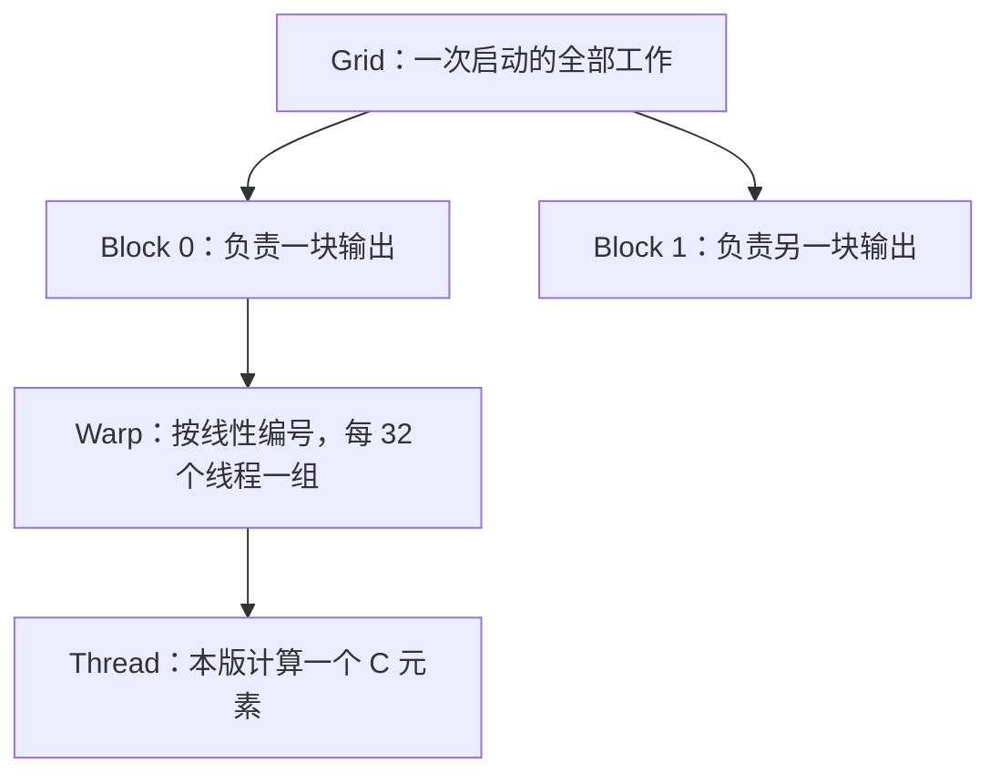
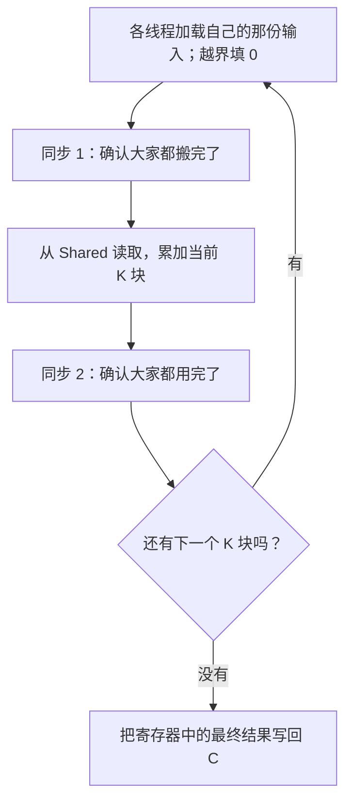
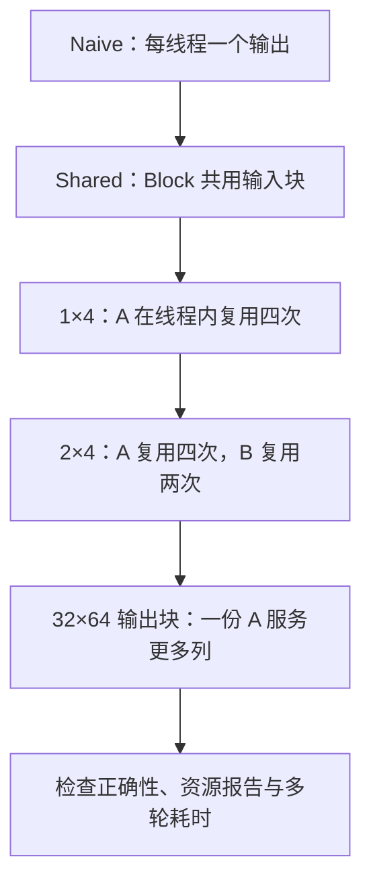

最直接的 CUDA 矩阵乘法，是让每个线程计算一个输出元素。代码不长，行列索引写对，基本就能跑起来。

不过，相邻输出往往会用到相同的 A、B 数据。如果每个线程都各读各的，就会产生不少重复读取。后面的优化主要围绕这件事展开：哪些数据可以共享，哪些值可以读进寄存器后多用几次。

这组实验依次尝试了 **Shared Memory Tiling（共享内存分块）**、调整 block 形状和 **Register Tiling（寄存器分块）**。在 `1024×1024` 的 FP32 矩阵乘法上，吞吐从约 **0.94 TFLOPS 提升到了 5.65 TFLOPS，约 6 倍加速**。

下面从矩阵索引和线程分工讲起，再逐步看每个版本改了什么。六版 kernel 都完整放在对应章节里，包括边界处理和启动方式。


基础还熟悉的话，可以从第 4 节的共享内存分块开始读。查代码直接用目录，快速回顾看最后的“复习五问”。动画需要手动播放，也可以单步查看或拖动进度。


## 1. 矩阵乘法基础

### 矩阵与维度

GEMM 是 General Matrix Multiplication（通用矩阵乘法）的缩写。本文使用 FP32，也就是每个元素占 4 字节的单精度浮点数，计算最基础的 `C = A × B`：

\[
A_{M\times K}\times B_{K\times N}=C_{M\times N}
\]

| 符号 | 含义 | 在代码里决定什么 |
|---|---|---|
| M | A、C 的行数 | 输出有多少行 |
| N | B、C 的列数 | 输出有多少列 |
| K | A 的列数、B 的行数 | 每个输出要累加多少项 |

`C[row][col]` 的计算方法是：拿 A 的第 `row` 行和 B 的第 `col` 列，对应位置相乘，再把结果加起来。

\[
C_{row,col}=\sum_{k=0}^{K-1}A_{row,k}B_{k,col}
\]

这里的 `k` 可以理解成一根游标：它沿着 A 的一行往右走，同时沿着 B 的一列往下走。



**先试一下：** 选择 `C00`，单步推进。橙色是本步读取的 A，蓝色是 B；它们沿箭头进入同一个累加器。算完 `k=0` 并没有结束，还要把 `k=1` 的乘积加进去。

这个例子里：

```text
C00 = 2×1 + 1×2 = 4
C01 = 2×2 + 1×1 = 5
C10 = 3×1 + 2×2 = 7
C11 = 3×2 + 2×1 = 8
```

### 行主序与索引

这里的 A、B、C 都是 **row-major（行主序）**：先放第一行，再放第二行。

```text
A = [ a00 a01 a02 ]       内存 = [a00 a01 a02 | a10 a11 a12]
    [ a10 a11 a12 ]       偏移 =   0   1   2     3   4   5
```

所以二维位置要翻译成线性偏移：

```cpp
A[row * K + k]      // A 每行 K 个元素
B[k * N + col]      // B 每行 N 个元素
C[row * N + col]    // C 每行 N 个元素
```

也就是先跳过前面的整行，再加上列偏移。后面的分块实现仍然使用这三个索引，只是行列坐标的计算更复杂一些。

### 运算量与吞吐

`sum += a * b` 包含一次乘法和一次加法。编译器可能把它生成一条 **FMA（融合乘加）** 指令；统计运算量时，一次 FMA 仍按 **2 FLOPs** 算。

一个输出做 K 次乘加，整个矩阵有 MN 个输出，因此常用的 GEMM 运算量是：

\[
\text{FLOPs}\approx 2MNK
\]

FLOPs 表示运算量，FLOPS 表示每秒完成的运算量，差一个字母大小写，意思不一样。`1 TFLOPS = 10¹² FLOPS`。

## 2. Naive 实现

### 线程组织

**Kernel** 是在 GPU 上由许多线程执行的函数；CUDA 代码用 `__global__` 声明它，用 `<<<grid, block>>>` 指定启动规模。每个线程执行同一份函数代码，但通过自己的编号负责不同数据。

一次 kernel launch 启动一个 **grid**；grid 由许多 **block** 组成；block 里才是我们写代码时操作的 **thread**。



**SM（Streaming Multiprocessor）** 是 GPU 上执行线程的硬件单元：block 被分配到 SM 上执行，同一 block 的线程可以使用该 block 的 shared memory，并一起同步。一个 SM 通常可以同时容纳多个 block，但能容纳多少，取决于线程数、寄存器和 shared memory 等资源。

Naive 版采用二维 block：

```cpp
dim3 block(16, 16);  // x 方向 16 个线程，y 方向 16 个线程
```

`threadIdx` 是线程在 block 内的位置，`blockIdx` 是 block 在 grid 内的位置。把“哪一块”和“块内哪一格”拼起来，就是输出坐标：

```cpp
row = blockIdx.y * blockDim.y + threadIdx.y;
col = blockIdx.x * blockDim.x + threadIdx.x;
```

例如 `blockIdx=(2,1)`、`threadIdx=(3,5)`，那么这个线程负责 `C[21][35]`：行是 `1×16+5`，列是 `2×16+3`。

### Naive 完整代码

```cpp
// V1 naive 实现：一个线程负责计算结果矩阵 C 中的一个元素。
__global__ void matmul_naive(const float* A, const float* B, float* C, int M, int K, int N) {
    // 根据 block 和 thread 的编号，找到当前线程负责的行、列。
    // cuda 习惯 x → column , y → row
    const int row = blockIdx.y * blockDim.y + threadIdx.y;
    const int col = blockIdx.x * blockDim.x + threadIdx.x;

    // 矩阵大小不一定正好是 block 大小的整数倍，因此需要检查边界。
    if (row < M && col < N) {
        float sum = 0.0f;

        // 当前线程计算 C[row][col]。
        for (int k = 0; k < K; ++k) {
            sum += A[row * K + k] * B[k * N + col];
        }

        C[row * N + col] = sum;
    }
}
```

启动时，让 grid 覆盖所有输出：

```cpp
dim3 block(16, 16);
dim3 grid((N + 15) / 16, (M + 15) / 16);
matmul_naive<<<grid, block>>>(d_A, d_B, d_C, M, K, N);
```

`(N+15)/16` 是向上取整。最后一个 block 中，一些线程对应的输出坐标可能越界，所以 kernel 内用 `row < M && col < N` 检查边界。

### 重复读取

固定某个 k，看看四个输出需要什么：

| 输出 | 读取 A | 读取 B |
|---|---|---|
| C00 | A0k | Bk0 |
| C01 | **A0k，再读一次** | Bk1 |
| C10 | A1k | **Bk0，再读一次** |
| C11 | **A1k，再读一次** | **Bk1，再读一次** |

四个线程分别取两个值，源码层面共八次输入读取，但不同的输入只有四个。

接下来可以让线程协作加载这些输入，放进 block 内共享的存储中，供其他线程复用。

注意，这里统计的是逻辑读取。GPU 还有缓存和访问合并，相同 global 地址被读两遍，不一定对应两次 DRAM 访问。后文比较的也是逻辑读取次数，不能直接用它推算耗时。

## 3. Warp 与访存

GPU 会把线程按线性编号每 32 个组成一个 warp。二维 block 中，`x` 变化最快：

```cpp
linear_tid = threadIdx.y * blockDim.x + threadIdx.x;
warp_id = linear_tid / 32;
lane_id = linear_tid % 32;
```

因此下面两种 block 都有 256 个线程、8 个 warp，但 warp 的形状不同：

```text
block(16,16) 的第一个 warp：
y=0: lane  0 ... 15    → 输出第 0 行的 16 列
y=1: lane 16 ... 31    → 输出第 1 行的 16 列

block(32,8) 的第一个 warp：
y=0: lane  0 ... 31    → 输出第 0 行的 32 列
```

**Coalescing（访存合并）** 关注的是：同一条 global load/store 指令下，一个 warp 的线程发出了怎样的地址请求，硬件能用多少内存事务满足它们。

如果相邻 lane 访问 B 的相邻列，地址通常比较紧凑；如果相邻 lane 相隔很远，就可能搬来很多并没有被用到的字节。这里的“连续”，是横着看 32 个线程的同一条指令，不是只看一个线程前后两次读了哪里。

还有一个容易误判的细节：在 Naive 的 `16×16` block 中，一个 warp 跨两个输出行，但这两行在固定 k 时读取的是**同一段 B 列**，并不是两段相隔很远的 B 行。所以，仅凭 warp 跨两个输出行，还不能判断访存是否低效。

具体合并行为与架构、对齐、访问宽度有关。[NVIDIA 的内存访问说明](https://docs.nvidia.com/cuda/cuda-programming-guide/02-basics/writing-cuda-kernels.html)可以作为进一步核对的依据。

实际分析时，可以先列出同一个 warp 各 lane 的地址，再看它们是否连续、重复或相隔很远。

## 4. 共享内存分块

### 存储层次

| 存储 | 谁能用 | 本文里放什么 | 需要注意什么 |
|---|---|---|---|
| Global Memory | 设备上的线程可通过指针访问 | 完整 A、B、C | 容量大；访问经过缓存等硬件路径 |
| Shared Memory | 同一 block 的线程 | 当前 A/B 输入块 | 程序显式管理；容量占用影响 block 驻留 |
| Registers | 单个线程 | 累加器、临时 A/B 值 | 很近，但数量有限；需查看编译分配结果 |

Shared memory 有点像 block 的公共工作台：线程把一块输入放上去，其他线程也能使用。寄存器则由各线程单独使用。实际访存还会经过缓存，不能把这张表当成完整的硬件结构图。

### 分块方法

设一个 block 负责 C 中 `16 行 × 16 列` 的区域。它要计算这些输出，就需要 A 对应的 16 行和 B 对应的 16 列。

K 很长，整条搬进 shared 未必放得下，所以沿 K 每次处理 16 项：

```text
这一轮输入： A 的 16×16 块 × B 的 16×16 块
                          ↓
这一轮计算： 更新同一块 C 的 16×16 个部分和
                          ↓
下一轮：    A 块沿 K 向右，B 块沿 K 向下，C 的位置不变
```

这里 **C 的位置不变**。每处理一段 K，就把这一段的乘积加进原来的部分和，直到所有 K 都算完。



**看图顺序：** 两边计算完全相同的 `2×2` 输出增量。左侧每次都从 global 输入发起读取；右侧先搬到 shared，再从工作台取。观察箭头从哪一层出发，以及右侧 global 计数何时停止增长。这个小例子把 `BK` 缩成 1，突出固定 k 的复用关系；真实版本一次搬入 16 个 k。

对真实 `16×16×16` 的一轮，输入和计算量分别是：

| 项目 | 数量 |
|---|---:|
| A 输入 | 16×16 = 256 个 float |
| B 输入 | 16×16 = 256 个 float |
| 乘加 | 16×16×16 = 4096 次 FMA |
| 每个 A 的使用次数 | 16 次，供不同输出列使用 |
| 每个 B 的使用次数 | 16 次，供不同输出行使用 |

每轮加载到 shared 的 512 个输入值，会被用于 4096 次乘加。每个 A、B 值都在 block 内复用了 16 次。

### K 分块动画

上一个对比只固定一个 k。下面把矩阵放大到 `4×4`，让一个 block 负责左上角 `2×2` 输出，每轮 `BK=2`。先处理 `k=0,1`，再处理 `k=2,3`，把两轮增量加到同一块 C 上。



橙色 A 窗口沿列向右走，蓝色 B 窗口沿行向下走；绿色 C 窗口一直不动。动画里的“轮”对应外层 `tile` 循环，窗口内部的两项累加对应内层 `k` 循环。

### 两次同步

一轮的顺序是：



第一次同步，等所有线程把输入搬完，避免读到尚未写入的数据。第二次同步，等所有线程把当前输入用完，避免某些线程提前覆盖 shared、装入下一块。少一次，都可能读错数据。

边界也在这里变得重要：**输出越界的线程仍应参与协作加载和同步**。不能在最前面直接 `return`。输入越界时往 shared 填 0，计算照常；最后只有合法输出写回 C。

### Shared 完整代码

```cpp
// V2 shared memory 实现：每个 block 负责计算 C 中一个 tile，使用共享内存缓存 A 和 B 的 tile。
constexpr int TILE = 16;

__global__ void matmul_shared(const float* A, const float* B, float* C, int M, int K, int N) {
    
    const int row = blockIdx.y * TILE + threadIdx.y;
    const int col = blockIdx.x * TILE + threadIdx.x;

    // 每个 block 都有自己的一份 shared memory。
    __shared__ float As[TILE][TILE];
    __shared__ float Bs[TILE][TILE];
    
    float sum = 0.0f;

    // 沿 K 维一块一块处理。
    for (int tile = 0; tile < (K + TILE - 1) / TILE; ++tile) {

        // 当前线程负责从 A 搬一个元素。
        const int a_col = tile * TILE + threadIdx.x;
        if (row < M && a_col < K) {
            As[threadIdx.y][threadIdx.x] = A[row * K + a_col];
        } else {
            As[threadIdx.y][threadIdx.x] = 0.0f;
        }

        // 当前线程负责从 B 搬一个元素。
        const int b_row = tile * TILE + threadIdx.y;
        if (b_row < K && col < N) {
            Bs[threadIdx.y][threadIdx.x] = B[b_row * N + col];
        } else {
            Bs[threadIdx.y][threadIdx.x] = 0.0f;
        }

        // 等整个 block 把 A/B tile 搬完。
        __syncthreads();

        // 现在所有数据都在 shared memory 中。
        for (int k = 0; k < TILE; ++k) {
            sum += As[threadIdx.y][k] * Bs[k][threadIdx.x];
        }

        // 确保所有线程用完当前 tile，
        // 才能覆盖 shared memory 加载下一块。
        __syncthreads();
    }

    // 只有有效线程负责把结果写回 C。
    if (row < M && col < N) {
        C[row * N + col] = sum;
    }
}
```

启动尺寸与 Naive 相同，但必须使用 `16×16` 的 block，因为索引和 shared 数组都是按 `TILE=16` 写的：

```cpp
dim3 block(TILE, TILE);
dim3 grid((N + TILE - 1) / TILE, (M + TILE - 1) / TILE);
matmul_shared<<<grid, block>>>(d_A, d_B, d_C, M, K, N);
```

如果真实 `K=35、TILE=16`，外层会跑三轮：前两轮处理 `k=0..15` 和 `16..31`，最后一轮处理 `32..34`；剩余 13 个位置填 0。这样内层仍能固定循环 16 次，多出来的乘积是 0，不会改变结果。

对应记录中，这一步从 **0.94 到 1.84 TFLOPS，约 1.95 倍**。后面的寄存器分块会继续保留这套 shared 加载和同步流程。

## 5. 调整 Block

### 尺寸约定

这里先区分几种尺寸，后面看索引时会用到：

| 名称 | 含义 | 本文约定 |
|---|---|---|
| Block shape | 启动多少线程 | `block(x,y)`，先列方向、后行方向 |
| Block tile | 一个 block 计算多少输出 | `BM×BN`，先行、后列 |
| K tile | 每轮处理多少个 k | `BK` |
| Thread tile | 一个线程计算多少输出 | `TM×TN`，先行、后列 |

在一个线程一个输出时，block shape 与输出块可以直接对应；一个线程计算多个输出后，两者就不再直接对应。不要看到 `32×8` 就自动认为 C tile 也是 32 行 8 列。

### 32×8：复用取舍

`block(32,8)` 的一个 warp 正好沿 x 占一行，但 C 输出块是 **8 行 × 32 列**。这一版还把 BK 改为 32：

- A tile 是 `8×32`，256 个值；每线程搬 1 个。
- B tile 是 `32×32`，1024 个值；每线程搬 4 个。
- 每个 A 服务 32 列输出，每个 B 只服务 8 行输出。

因此 A 复用多了，B 复用少了；加载循环和 K 分块长度也变了。比较性能时，需要把这些变化一起考虑。

### 32×8 完整代码

```cpp
// 32 x 8 block：一个 warp 正好覆盖输出矩阵的一整行。
constexpr int BLOCK_X_32X8 = 32;
constexpr int BLOCK_Y_32X8 = 8;
constexpr int TILE_K_32X8 = 32;

__global__ void matmul_shared_32x8(const float* A, const float* B, float* C, int M, int K, int N) {
    const int row = blockIdx.y * BLOCK_Y_32X8 + threadIdx.y;
    const int col = blockIdx.x * BLOCK_X_32X8 + threadIdx.x;
    __shared__ float As[BLOCK_Y_32X8][TILE_K_32X8];
    __shared__ float Bs[TILE_K_32X8][BLOCK_X_32X8];
    float sum = 0.0f;

    for (int tile = 0; tile < (K + TILE_K_32X8 - 1) / TILE_K_32X8; ++tile) {
        const int a_col = tile * TILE_K_32X8 + threadIdx.x;
        if (row < M && a_col < K) {
            As[threadIdx.y][threadIdx.x] = A[row * K + a_col];
        } else {
            As[threadIdx.y][threadIdx.x] = 0.0f;
        }

        // 8 行线程共同加载 32 行 B，每个线程加载 4 个元素。
        for (int b_row = threadIdx.y; b_row < TILE_K_32X8; b_row += BLOCK_Y_32X8) {
            const int global_b_row = tile * TILE_K_32X8 + b_row;
            if (global_b_row < K && col < N) {
                Bs[b_row][threadIdx.x] = B[global_b_row * N + col];
            } else {
                Bs[b_row][threadIdx.x] = 0.0f;
            }
        }

        __syncthreads();
        for (int k = 0; k < TILE_K_32X8; ++k) {
            sum += As[threadIdx.y][k] * Bs[k][threadIdx.x];
        }
        __syncthreads();
    }

    if (row < M && col < N) {
        C[row * N + col] = sum;
    }
}
```

```cpp
dim3 block(32, 8);
dim3 grid((N + 31) / 32, (M + 7) / 8);
matmul_shared_32x8<<<grid, block>>>(d_A, d_B, d_C, M, K, N);
```

### 32×32：资源代价

`block(32,32)` 有 1024 个线程、32 个 warp，负责 `32×32` 输出，A/B 都能被复用 32 次。同时，每个 block 的资源需求也增加了。

原编译记录显示每线程 38 个寄存器、每 block 8192 B shared memory、无 spill。仅按线程数乘寄存器数，已经是 `1024×38=38912` 个 32-bit 寄存器；硬件分配还可能受粒度限制。一个 block 很大，就可能限制同一个 SM 上其他 block 的驻留数量。

**Occupancy（占用率）** 是一个 SM 驻留的活跃 warp 数相对于硬件最大可驻留 warp 数的比例。“驻留”不等于“每一拍都在算”：有些 warp 可能正在等待数据或依赖。调度器能从就绪 warp 中选择工作，因此保留更多 warp 有助于隐藏等待，但它们也要有可执行的工作才行。

Occupancy 达到 100% 也不保证最快，较低占用率也可能凭借更好的复用和更多线程内独立计算获得更高吞吐。有关资源限制的定义可参见 [NVIDIA Occupancy 说明](https://docs.nvidia.com/cuda/archive/12.3.0/cuda-c-best-practices-guide/index.html#occupancy)。

### 32×32 完整代码

```cpp
// 32 x 32 block：每个 block 有 1024 个线程，整个 tile 都由一个 block 计算。
constexpr int TILE_32 = 32;

__global__ void matmul_shared_32x32(const float* A, const float* B, float* C, int M, int K, int N) {
    const int row = blockIdx.y * TILE_32 + threadIdx.y;
    const int col = blockIdx.x * TILE_32 + threadIdx.x;
    __shared__ float As[TILE_32][TILE_32];
    __shared__ float Bs[TILE_32][TILE_32];
    float sum = 0.0f;

    for (int tile = 0; tile < (K + TILE_32 - 1) / TILE_32; ++tile) {
        
        const int a_col = tile * TILE_32 + threadIdx.x;
        const int b_row = tile * TILE_32 + threadIdx.y;

        if (row < M && a_col < K) {
            As[threadIdx.y][threadIdx.x] = A[row * K + a_col];
        } else {
            As[threadIdx.y][threadIdx.x] = 0.0f;
        }

        if (b_row < K && col < N) {
            Bs[threadIdx.y][threadIdx.x] = B[b_row * N + col];
        } else {
            Bs[threadIdx.y][threadIdx.x] = 0.0f;
        }

        __syncthreads();
        for (int k = 0; k < TILE_32; ++k) {
            sum += As[threadIdx.y][k] * Bs[k][threadIdx.x];
        }
        __syncthreads();
    }

    if (row < M && col < N) {
        C[row * N + col] = sum;
    }
}
```

```cpp
dim3 block(32, 32);
dim3 grid((N + 31) / 32, (M + 31) / 32);
matmul_shared_32x32<<<grid, block>>>(d_A, d_B, d_C, M, K, N);
```

三种 Shared 实现的记录都在 **1.82～1.84 TFLOPS** 左右。差距不到 1%，在没有多轮波动统计时，先把它们看作性能接近。我们观察到了“这些改法没有明显提速”，但还没有证据把原因定为某一项资源限制。

## 6. 寄存器分块

### 线程内复用

前面的 shared 版中，每个线程只保留一个累加器：

```cpp
sum += As[row][k] * Bs[k][col];
```

现在换个分工：同一线程负责连续四列输出 `C[row][col+0..3]`。固定 k 时，这四个输出需要的 A 完全相同，所以线程可以把 A 读入一次，留在寄存器里连续用四次：

```cpp
const float a = As[row_in_tile][k];
sum0 += a * Bs[k][col_in_tile + 0];
sum1 += a * Bs[k][col_in_tile + 1];
sum2 += a * Bs[k][col_in_tile + 2];
sum3 += a * Bs[k][col_in_tile + 3];
```

四个 `sum` 分别保留四列的部分和，共用同一个 `a`。因此每个 k 只需读取一次 A，就能更新四个输出。

### 线程分工动画



三种模式计算的是**同一块 2×4 输出、相同的两轮 k**。数字会真实累加，结果相同，区别在于每个线程保留多少输入与结果。

以固定一个 k、更新同一块 `2×4` 输出为比较口径：

| 线程分工 | 需要几个线程 | A 标量读取 | B 标量读取 | 输入读取合计 | FMA |
|---|---:|---:|---:|---:|---:|
| 1×1 | 8 | 8 | 8 | 16 | 8 |
| 1×4 | 2 | 2 | 8 | 10 | 8 |
| 2×4 | 1 | 2 | 4 | 6 | 8 |

1×4 先省下重复的 A 读取；2×4 再省下两行之间重复的 B 读取。三种分工的乘加数量相同，但寄存器中保留的输入得到了更多复用。

表中统计的是源码层面的标量读取，不是 shared bank 事务数。跨线程广播和编译器生成的指令会影响真实硬件开销。除此之外，多个独立累加器还增加了线程内独立指令的机会；具体收益需要结合资源分配和生成代码判断。

### 1×4 线程映射

1×4 版仍启动 `32×8=256` 个线程，但每个线程计算 4 个输出，所以总共覆盖 `256×4=1024` 格，即 `32×32` 的输出块。

每行需要 `32/4=8` 个线程。将线程编号线性化后，就能重新分工：

```cpp
linear_tid = threadIdx.y * blockDim.x + threadIdx.x;
row_in_tile = linear_tid / 8;
col_in_tile = (linear_tid % 8) * 4;
```

| 线程编号 | 输出行 | 起始列 | 负责的列 |
|---|---:|---:|---|
| 0 | 0 | 0 | 0～3 |
| 1 | 0 | 4 | 4～7 |
| 7 | 0 | 28 | 28～31 |
| 8 | 1 | 0 | 0～3 |
| 255 | 31 | 28 | 28～31 |

`threadIdx.x` 现在只是编号的一部分，不再直接等于输出列。要找到它负责的输出，需要经过上面这次映射。

### 协作加载

这一版 `BM=32, BN=32, BK=16`。A tile 和 B tile 各有 512 个元素，而 block 只有 256 个线程，所以每线程各搬两个元素。

不用为每个线程手写两个坐标。让线程编号当作起点，每次跨过整个线程数：

```cpp
for (int index = linear_tid; index < BM * BK; index += 256) {
    int a_row_in_tile = index / BK;
    int a_col_in_tile = index % BK;
    // 据此读取 global A，写入 shared As；越界位置填 0。
}
```

例如线程 0 搬 `index=0,256`，线程 1 搬 `index=1,257`。二维坐标由除法和取模还原，各线程共同把整块输入填满。

**搬运分工不必等于计算分工。** 负责 C 第 0 行的线程，完全可以帮忙搬 A 的其他行。加载后，这些数据由整个 block 共享；计算前仍需同步，确保输入已经到齐。

### 1×4 完整代码

```cpp
// V3：32 x 8 个线程共同覆盖一个 32 x 32 的输出 tile。
// 每个线程计算同一行中连续的 4 个 C 元素，也就是 1 x 4 register tile。
constexpr int BM = 32;
constexpr int BN = 32;
constexpr int BK = 16;
constexpr int TN = 4;
constexpr int COL_GROUPS = BN / TN;

__global__ void matmul_reg_1x4(const float* A, const float* B, float* C, int M, int K, int N) {
    const int ty = threadIdx.y;
    const int tx = threadIdx.x;
    const int linear_tid = ty * blockDim.x + tx;

    // 32 x 8 个线程共有 256 个线程。
    // 每 8 个线程负责一行，每个线程负责连续 4 列，正好覆盖 32 x 32。
    const int row_in_tile = linear_tid / COL_GROUPS;
    const int col_in_tile = (linear_tid % COL_GROUPS) * TN;
    const int row = blockIdx.y * BM + row_in_tile;
    const int col = blockIdx.x * BN + col_in_tile;

    // K 方向每次处理 BK 个元素：A tile 是 32 x 16，B tile 是 16 x 32。
    __shared__ float As[BM][BK];
    __shared__ float Bs[BK][BN];

    // 4 个累加变量会放在寄存器中，分别对应当前线程负责的 4 个输出。
    // 写成独立变量，初学时更容易看清每个结果的计算过程。
    float sum0 = 0.0f;
    float sum1 = 0.0f;
    float sum2 = 0.0f;
    float sum3 = 0.0f;

    for (int tile = 0; tile < (K + BK - 1) / BK; ++tile) {
        // 合作加载 A tile。A tile 有 32 x 16 个元素，256 个线程各加载两次。
        for (int index = linear_tid; index < BM * BK; index += blockDim.x * blockDim.y) {
            const int a_row_in_tile = index / BK;
            const int a_col_in_tile = index % BK;
            const int a_row = blockIdx.y * BM + a_row_in_tile;
            const int a_col = tile * BK + a_col_in_tile;

            if (a_row < M && a_col < K) {
                As[a_row_in_tile][a_col_in_tile] = A[a_row * K + a_col];
            } else {
                As[a_row_in_tile][a_col_in_tile] = 0.0f;
            }
        }

        // 合作加载 B tile。B tile 有 16 x 32 个元素，256 个线程各加载两次。
        for (int index = linear_tid; index < BK * BN; index += blockDim.x * blockDim.y) {
            const int b_row_in_tile = index / BN;
            const int b_col_in_tile = index % BN;
            const int b_row = tile * BK + b_row_in_tile;
            const int b_col = blockIdx.x * BN + b_col_in_tile;

            if (b_row < K && b_col < N) {
                Bs[b_row_in_tile][b_col_in_tile] = B[b_row * N + b_col];
            } else {
                Bs[b_row_in_tile][b_col_in_tile] = 0.0f;
            }
        }

        // 等待整个 block 完成 tile 加载。
        __syncthreads();

        // 一个 A 值同时更新 4 个寄存器累加器。
        for (int k = 0; k < BK; ++k) {
            const float a = As[row_in_tile][k];
            sum0 += a * Bs[k][col_in_tile + 0];
            sum1 += a * Bs[k][col_in_tile + 1];
            sum2 += a * Bs[k][col_in_tile + 2];
            sum3 += a * Bs[k][col_in_tile + 3];
        }

        // 确保所有线程都用完当前 tile，再加载下一块。
        __syncthreads();
    }

    // 处理边界 tile，只写回有效列。
    if (row < M) {
        if (col + 0 < N) C[row * N + col + 0] = sum0;
        if (col + 1 < N) C[row * N + col + 1] = sum1;
        if (col + 2 < N) C[row * N + col + 2] = sum2;
        if (col + 3 < N) C[row * N + col + 3] = sum3;
    }
}
```

```cpp
dim3 block(32, 8);
dim3 grid((N + BN - 1) / BN, (M + BM - 1) / BM);
matmul_reg_1x4<<<grid, block>>>(d_A, d_B, d_C, M, K, N);
```

注意 grid 按 **输出 tile** 的 `BM、BN` 算，不按 `blockDim.y=8` 算。每线程负责四个输出后，grid 也要按新的输出范围计算，否则可能重复或遗漏工作。

这一版达到 **3.76 TFLOPS**。除了寄存器复用，输出块也变成了 `32×32`；这是一组实现变化的总收益，不能全部归因于线程内的 A 复用。

## 7. 2×4 分块

### 外积与复用

1×4 只复用了 A。要让 B 也在线程内复用，就再多算一行。

固定 k，取出：

```text
A 的一小列：a0、a1
B 的一小行：b0、b1、b2、b3

                 b0       b1       b2       b3
                 ↓        ↓        ↓        ↓
a0 →           C00      C01      C02      C03
a1 →           C10      C11      C12      C13
```

用一列乘一行，得到一个小矩阵，这就是这里说的 **outer product（外积）**。每一轮 k 都产生一个 `2×4` 增量，把这些增量加起来才是最终输出。它与第一节“一行乘一列”的点积描述的是同一套计算，只是组织顺序不同。

回到上一节动画，选择 `2×4`：橙色 A 沿横向服务四列，蓝色 B 沿纵向服务两行，正好就是这个外积。

### 2×4 线程映射

现在输出 tile 取 `BM=32, BN=64`，每线程 `TM=2, TN=4`。横向共有 `64/4=16` 个四列组，纵向共有 `32/2=16` 个二行组，所以仍需要 256 个线程。

```cpp
row_in_tile = (linear_tid / 16) * 2;
col_in_tile = (linear_tid % 16) * 4;
```

| 线程编号 | 负责的行 | 负责的列 |
|---|---|---|
| 0 | 0～1 | 0～3 |
| 15 | 0～1 | 60～63 |
| 16 | 2～3 | 0～3 |
| 255 | 30～31 | 60～63 |

有两行输出，就要分别检查两行是否越界；不能只检查第一行，就默认第二行也能写入。

### 2×4 完整代码

```cpp
// V4：每个线程计算 2 行 x 4 列，一共 8 个输出。
// 继续使用 32 x 8 个线程，因此一个 block 覆盖 32 x 64 的输出 tile。
constexpr int BM_2X4 = 32;
constexpr int BN_2X4 = 64;
constexpr int BK_2X4 = 16;
constexpr int TM_2X4 = 2;
constexpr int TN_2X4 = 4;
constexpr int COL_GROUPS_2X4 = BN_2X4 / TN_2X4;

__global__ void matmul_reg_2x4(const float* A, const float* B, float* C, int M, int K, int N) {
    const int ty = threadIdx.y;
    const int tx = threadIdx.x;
    const int linear_tid = ty * blockDim.x + tx;

    // 256 个线程映射成 16 个二行组 x 16 个四列组。
    const int row_group = linear_tid / COL_GROUPS_2X4;
    const int col_group = linear_tid % COL_GROUPS_2X4;
    const int row_in_tile = row_group * TM_2X4;
    const int col_in_tile = col_group * TN_2X4;
    const int row = blockIdx.y * BM_2X4 + row_in_tile;
    const int col = blockIdx.x * BN_2X4 + col_in_tile;

    // V4 暂时不做 padding，先观察 register tiling 本身的效果。
    __shared__ float As[BM_2X4][BK_2X4];
    __shared__ float Bs[BK_2X4][BN_2X4];

    float sum0 = 0.0f;
    float sum1 = 0.0f;
    float sum2 = 0.0f;
    float sum3 = 0.0f;
    float sum4 = 0.0f;
    float sum5 = 0.0f;
    float sum6 = 0.0f;
    float sum7 = 0.0f;

    for (int tile = 0; tile < (K + BK_2X4 - 1) / BK_2X4; ++tile) {
        // 合作加载 A tile。
        for (int index = linear_tid; index < BM_2X4 * BK_2X4; index += blockDim.x * blockDim.y) {
            const int a_row_in_tile = index / BK_2X4;
            const int a_col_in_tile = index % BK_2X4;
            const int a_row = blockIdx.y * BM_2X4 + a_row_in_tile;
            const int a_col = tile * BK_2X4 + a_col_in_tile;

            if (a_row < M && a_col < K) {
                As[a_row_in_tile][a_col_in_tile] = A[a_row * K + a_col];
            } else {
                As[a_row_in_tile][a_col_in_tile] = 0.0f;
            }
        }

        // 合作加载 B tile。
        for (int index = linear_tid; index < BK_2X4 * BN_2X4; index += blockDim.x * blockDim.y) {
            const int b_row_in_tile = index / BN_2X4;
            const int b_col_in_tile = index % BN_2X4;
            const int b_row = tile * BK_2X4 + b_row_in_tile;
            const int b_col = blockIdx.x * BN_2X4 + b_col_in_tile;

            if (b_row < K && b_col < N) {
                Bs[b_row_in_tile][b_col_in_tile] = B[b_row * N + b_col];
            } else {
                Bs[b_row_in_tile][b_col_in_tile] = 0.0f;
            }
        }

        __syncthreads();

        // 每个 k 同时更新两行、四列的 8 个寄存器累加器。
        for (int k = 0; k < BK_2X4; ++k) {
            const float a0 = As[row_in_tile + 0][k];
            const float a1 = As[row_in_tile + 1][k];
            const float b0 = Bs[k][col_in_tile + 0];
            const float b1 = Bs[k][col_in_tile + 1];
            const float b2 = Bs[k][col_in_tile + 2];
            const float b3 = Bs[k][col_in_tile + 3];

            sum0 += a0 * b0;
            sum1 += a0 * b1;
            sum2 += a0 * b2;
            sum3 += a0 * b3;
            sum4 += a1 * b0;
            sum5 += a1 * b1;
            sum6 += a1 * b2;
            sum7 += a1 * b3;
        }

        __syncthreads();
    }

    if (row < M) {
        if (col + 0 < N) C[row * N + col + 0] = sum0;
        if (col + 1 < N) C[row * N + col + 1] = sum1;
        if (col + 2 < N) C[row * N + col + 2] = sum2;
        if (col + 3 < N) C[row * N + col + 3] = sum3;
    }
    if (row + 1 < M) {
        if (col + 0 < N) C[(row + 1) * N + col + 0] = sum4;
        if (col + 1 < N) C[(row + 1) * N + col + 1] = sum5;
        if (col + 2 < N) C[(row + 1) * N + col + 2] = sum6;
        if (col + 3 < N) C[(row + 1) * N + col + 3] = sum7;
    }
}
```

```cpp
dim3 block(32, 8);
dim3 grid((N + BN_2X4 - 1) / BN_2X4,
          (M + BM_2X4 - 1) / BM_2X4);
matmul_reg_2x4<<<grid, block>>>(d_A, d_B, d_C, M, K, N);
```

### 扩大输出块

这一版同时把 block tile 从 `32×32` 扩成 `32×64`。比较同一个输出区域、同一段 `BK=16`：



**这次只盯住橙色 A：** 上方是同一份 global A。左图要把它分别搬进两个 block 的私有 shared 区域；右图只有一个更宽的 block，两个输出半区从同一份 shared A 取值。蓝色 B 的左右两半本来就是不同数据，不能用同样方式省掉。

| 方案 | A 输入 | B 输入 | 总计 |
|---|---:|---:|---:|
| 两个 32×32 block | 512×2 | 512×2 | 2048 floats |
| 一个 32×64 block | 512 | 1024 | 1536 floats |

于是输入 tile 的逻辑加载量减少 `512/2048=25%`。这不意味着耗时减少 25%，也不意味着 DRAM 流量一定减少 25%：两个 block 的重复 global 读取可能命中缓存。这里减少的是显式加载到 shared 的输入量。

### 算术强度

算术强度就是运算量除以数据量。在这里只统计一轮 A/B 的输入，不计 C 最终写回、不考虑缓存、边界和其他开销：

\[
I=\frac{2B_MB_NB_K}{4(B_MB_K+B_KB_N)}\quad\text{FLOP/B}
\]

分子是输出数乘每输出的乘加数；分母是 A/B 元素数乘 FP32 的 4 字节。

| 输出 tile，BK=16 | 运算量 | 输入字节 | 输入算术强度 |
|---|---:|---:|---:|
| 32×32 | 32,768 FLOPs | 4,096 B | 8 FLOP/B |
| 32×64 | 65,536 FLOPs | 6,144 B | 10.67 FLOP/B |

更宽的块让同一份 A 服务更多输出列，因而每字节输入能支撑更多计算。但 tile 继续扩大还会消耗更多资源、减少 grid 中的 block 数，并不是越大越好。

记录中的最终结果是 **5.65 TFLOPS**，相对 1×4 再提高约 **1.50 倍**。线程 tile 和 block tile 同时变化，所以这是两项改动的联合收益。

### 寄存器分配

| 原编译记录 | Registers / thread | Shared / block | Spill loads / stores |
|---|---:|---:|---:|
| Register 1×4 | 40 | 4096 B | 0 / 0 |
| Register 2×4 | 40 | 6144 B | 0 / 0 |

源码里四个 `sum` 变成八个，并不代表最终寄存器总量翻倍。编译器还要给索引、临时值等安排寄存器，并能让活跃时间不重叠的变量复用位置。

实际用了多少寄存器，还是要看编译输出，单数源码里的变量不太靠谱。`spill` 表示寄存器分配溢出后的一类额外存取；这里两版报告都为零。这是当次编译配置的结果，换架构、工具链或参数后应重新检查。

## 8. Padding 实验

### Bank 冲突

Shared memory 分成多个 bank，以便并行服务访问。在常见的 32 个 bank、32-bit 字访问模型中：

```text
bank = float 元素偏移 % 32
```

同一条 warp 读取指令中，如果不同线程访问同一个 bank 的**不同字**，请求可能需要拆分处理；如果访问的是**同一个字**，则可广播，不能按“线程多”就认定冲突。[NVIDIA 的 shared memory 说明](https://docs.nvidia.com/cuda/cuda-programming-guide/02-basics/writing-cuda-kernels.html#shared-memory)区分了这两种模式。

仍以 1×4 版为例。每 8 个线程计算一行，一个 warp 对应四行。读 `As[row_in_tile][k]` 时，行内八个线程读同一个值，可以广播；四行之间的 bank 映射则是：

| 行 | As[32][16] 的偏移 | bank（取 k=0） | 加一列后偏移 | 新 bank |
|---|---:|---:|---:|---:|
| 0 | 0 | 0 | 0 | 0 |
| 1 | 16 | 16 | 17 | 17 |
| 2 | 32 | 0 | 34 | 2 |
| 3 | 48 | 16 | 51 | 19 |

把行跨度从 16 变成 17，打散了这四行的 bank 重合。所以才有这个候选改法：

```cpp
__shared__ float As[32][16];  // 原版
__shared__ float As[32][17];  // Padding：每行末尾留一格不用
```

逻辑上仍只使用每行前 16 个 k，补的一列只是改变物理跨度。计算范围不变，行末多出来的一个位置不用。

### 性能回退

| 同一轮 1×4 对比 | GFLOPS |
|---|---:|
| 原始布局 | 3747.8 |
| Padding 布局 | 3317.6 |

吞吐下降约 **11.5%**，因此当前源码没有保留 padding 改动。这里使用该轮自己的基线，避免拿另一轮的 3761.7 混着比较。

能从源码推导某种潜在冲突，不代表它就是主要瓶颈；改变布局还会改变协作写入的地址分布、地址计算和可能的指令选择。究竟是哪项造成下降，需要生成代码与 profiler 数据，现有记录不能定因。

这次先保留未 padding 的版本。至于为什么变慢，还得等补上 profiling 再解释。

## 9. 性能与复现

### 结果与配置

以下保留原实验记录，本文没有重新跑 GPU 测试：

| Kernel | Time | GFLOPS | 相对 Naive |
|---|---:|---:|---:|
| Naive 16×16 | 2.283 ms | 940.6 | 1.00× |
| Shared 16×16 | 1.170 ms | 1835.7 | 1.95× |
| Shared 32×8 | 1.179 ms | 1822.2 | 1.94× |
| Shared 32×32 | 1.180 ms | 1819.7 | 1.93× |
| Register 1×4 | 0.571 ms | 3761.7 | 4.00× |
| **Register 2×4** | **0.380 ms** | **5648.6** | **6.01×** |

时间为展示后的舍入值，因此用表中时间倒算吞吐，末位可能不完全一致。

| 版本 | 线程块 x×y | 输出 BM×BN | BK | 每线程 TM×TN |
|---|---:|---:|---:|---:|
| Naive | 16×16 | 16×16 | 不分块 | 1×1 |
| Shared 16×16 | 16×16 | 16×16 | 16 | 1×1 |
| Shared 32×8 | 32×8 | 8×32 | 32 | 1×1 |
| Shared 32×32 | 32×32 | 32×32 | 32 | 1×1 |
| Register 1×4 | 32×8 | 32×32 | 16 | 1×4 |
| Register 2×4 | 32×8 | 32×64 | 16 | 2×4 |

### 测试口径

当前示例使用行主序 FP32，测试 `M=N=K=1024` 的 `C=AB`，没有使用 Tensor Core。benchmark 先预热一次，再用 CUDA Events 测量重复 kernel launch 的平均设备时间；CPU 参考计算、内存分配以及主机与设备之间的复制都在计时区间之外。

原记录没有保留当次 GPU 型号、CUDA/驱动版本、编译参数和 repeat 值，所以这些数字适合说明这组实现的实验路径，暂时不能作为完整可复现的硬件性能结论。也没有 cuBLAS 对照，不能据此判断离设备的最佳 GEMM 性能还有多远。

完整程序会把输出与 CPU 参考结果逐元素比较，绝对误差阈值是 `1e-3`。这能检查当前输入下的计算，但不是对所有尺寸和数值范围的证明。继续实验时，至少补上非整块尺寸，例如 `N=33、65`，以及不同数值分布；通用验证还应明确相对误差和非有限值的处理方式。

### 源码与复现

本文六个 kernel 及其常量、注释都来自 `mini-tensor/examples/matmul.cu`，对应的[完整可下载源码](../../downloads/cuda-gemm.cu)还包含 CUDA 错误检查、host wrapper、数据初始化、CPU 参考实现、计时和结果检查。

下面是重新运行时的一个基础命令示例，**不是原实验编译命令的还原**：

```bash
nvcc -O3 -Xptxas=-v cuda-gemm.cu -o matmul
./matmul 1024 100
```

示例命令使用下载后的文件名 `cuda-gemm.cu`；在原项目中则把它替换为 `matmul.cu`。要做正式对比，还应显式记录目标 GPU 架构和完整编译命令，保留编译资源报告，并重复多轮统计波动。程序第一个参数是 N，第二个是 repeat；源码默认值分别是 512 和 10。

## 10. 复习五问

**第一问：一个输出怎么算？** A 的一行与 B 的一列做点积，k 逐项前进，结果累加到同一个位置。拿不准就回第一节动画，亲手算一次 `C00`。

**第二问：谁在重复使用同一份输入？** 同一输出行的不同列共享 A；同一输出列的不同行共享 B。Shared Tiling 把这种复用安排在 block 内。

**第三问：一个线程能不能多算几格？** 1×4 让一个 A 更新四个输出；2×4 又让每个 B 更新两行。累加器一直留在寄存器中，所有 K 算完再写回。

**第四问：几种 tile 各在描述什么？** `BM×BN` 是 block 的输出范围，`BK` 是每轮处理的 k 数，`TM×TN` 是线程的输出范围。线程块尺寸决定线程数，输出 tile 决定这些线程要计算的范围。

**第五问：为什么不能一路把 tile 加大？** 共享内存、寄存器、线程数和可驻留 block 都有限；扩大复用会改变并行度和资源需求。所以每次调整后，都需要重新测量耗时并检查资源使用。



CPU GEMM 里的 cache blocking、register blocking，与这里的分块复用有相通之处：都在想办法让取来的数据多参与几次计算。区别在于共享方式、调度方式和需要手工管理的部分不同。

这组实现先到这里。后续可以继续尝试向量化加载、双缓冲和异步复制；在此之前，值得多花点时间把这几版的线程映射和数据复用画清楚。看代码时能对应上每个线程在搬什么、算什么，再改参数会踏实得多。
