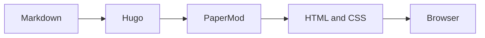

这是博客的第一篇文章，也顺便作为站点能力自检：如果你能正常看到下面的代码、公式、流程图和提示框，说明这套写作工具链已经可以开工了。

## 代码高亮

下面是一段 C++，用来检查语法高亮、等宽字体、长行横向滚动和代码复制按钮：

```cpp
#include <cstdint>
#include <iostream>

std::uint32_t rotate_left(std::uint32_t value, unsigned shift) {
    shift %= 32;
    return (value << shift) | (value >> ((32 - shift) % 32));
}

int main() {
    const auto input = std::uint32_t{0x12345678};
    std::cout << std::hex << rotate_left(input, 7) << '\n';
}
```

## 数学公式

行内公式可以这样写：\( f_{lower}(x) \equiv f_{source}(x) \)。

块公式则适合写更完整的关系：

$$
\Delta(x) = \left| f_{lower}(x) - f_{source}(x) \right|
$$

实际研究中还需要定义允许的数值误差、内存行为和目标后端约束，公式本身不会自动替我们写测试用例——可惜。

## Mermaid 图表



## Callout


如果你能看到这句话，说明 Markdown、Hugo shortcode 和自定义样式已经成功会师。


以后可以在 `content/posts/` 目录中新增 Markdown 文件，然后提交到 GitHub，由 Cloudflare 自动构建和发布。
