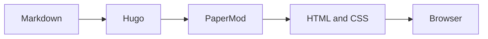

这是博客的第一篇文章，也顺便作为站点能力自检：如果你能正常看到下面的代码、公式、流程图和提示框，说明这套写作工具链已经可以开工了。

## 基本 Markdown 语法

这一节用来检查最常用的 Markdown 写法，目录也会通过下面的三级标题展示分级效果。

### 文本样式

普通文本可以使用 **粗体**、*斜体*、~~删除线~~ 和 `行内代码`。也可以使用 [GitHub 链接](https://github.com/LittlehamsterXu) 跳转到外部页面。

这是一段带有脚注的文字[^markdown]，用于确认长文档中的补充说明不会打乱正文阅读。

### 列表与嵌套

- 无序列表项目一
- 无序列表项目二
  - 二级项目
  - 另一个二级项目
- 无序列表项目三

1. 有序列表项目一
2. 有序列表项目二
   1. 二级有序项目
   2. 另一个二级有序项目
3. 有序列表项目三

### 引用

> 比如这个
>
> 引用可以包含多段文字，用来标记摘录、读书笔记或一段值得保留的话。
>
> > 也可以继续嵌套引用。

### 分隔线与转义

下面是一条水平分隔线：

---

Markdown 中的特殊字符可以使用反斜杠转义，例如 \*不会变成斜体\*。

## 代码高亮

### C++ 代码

下面是一段 C++，用来检查语法高亮、等宽字体、长行横向滚动和代码复制按钮：

```cpp
#include <cstdint>
#include <iostream>

std::uint32_t rotate_left(std::uint32_t value, unsigned shift) {
    shift %= 32;
    return (value << shift) | (value >> ((32 - shift) % 32));
}

int main() {
    const auto input = std::uint32_t{0x12345678};
std::cout << std::hex << rotate_left(input, 7) << '\n';
}
```

## 文本高亮

这是 ==重点文字== 的验证，应该显示为醒目的高亮文本；普通的 `代码片段` 则保持行内代码样式。

### 行内元素组合

**粗体中的 `代码`**、*斜体中的 [链接](https://gohugo.io/)* 和 ==高亮中的文字== 可以组合使用。

## 数学公式

### 行内公式

行内公式可以这样写：\( f_{lower}(x) \equiv f_{source}(x) \)。

### 块公式

块公式则适合写更完整的关系：

$$
\Delta(x) = \left| f_{lower}(x) - f_{source}(x) \right|
$$

实际使用时还需要补充误差范围、边界条件和测试用例；公式本身不会自动替我们完成这些工作——可惜。

## 折叠内容

### 可展开的补充说明

下面的内容默认收起，点击标题可以展开：


这里是折叠块内部的 Markdown 内容：

- 可以放文字
- 可以放列表
- 也可以放行内代码，例如 `hugo server`


## Mermaid 图表

### 一个简单的流程图



## Callout

### 提示框


如果你能看到这句话，说明 Markdown、Hugo shortcode 和自定义样式已经成功会师。


## 图片

### 本地图片与放大

下面是一张本地 SVG 图片，用于验证文章内图片和文章封面是否都能正常加载：


## 表格与任务列表

### 表格

| 能力 | 验证内容 | 预期结果 |
| --- | --- | --- |
| 表格 | Markdown table | 有边框、可读 |
| 任务列表 | 见下方清单 | 显示复选框 |
| 文本高亮 | ==文字== | 显示高亮 |

### 任务列表

- [x] 已完成的检查项
- [ ] 待完成的检查项

以后可以在 `content/posts/` 目录中新增 Markdown 文件，然后提交到 GitHub，由 Cloudflare 自动构建和发布。

[^markdown]: 脚注适合放置名词解释、参考来源或不会影响主线阅读的补充内容。
